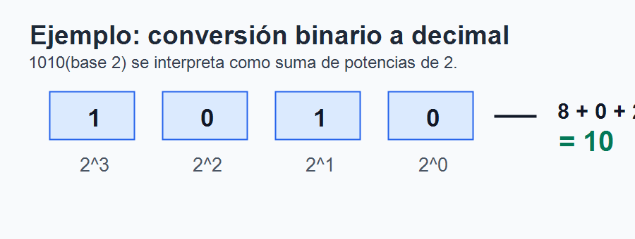
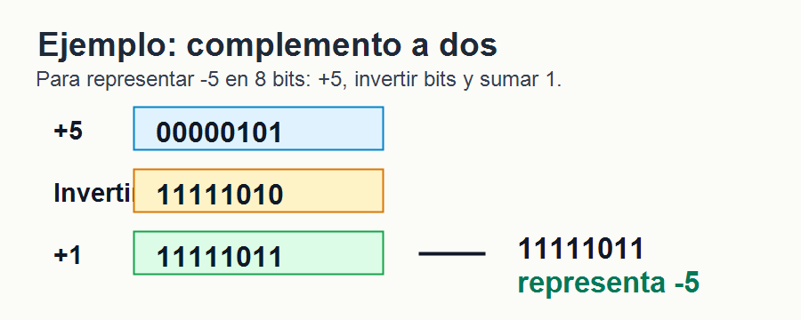
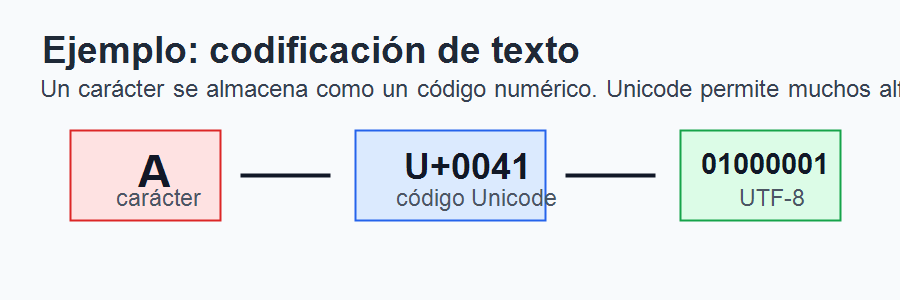
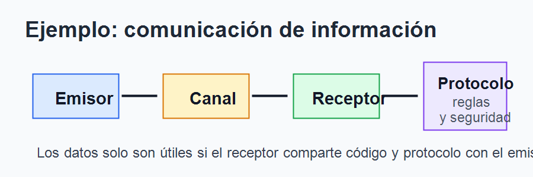

# Tema 1. Representación y comunicación de la información

## Índice

1. hola Introducción. 2. Información, dato y codificación. 3. Unidades de información. 4. Sistemas de numeración. 5. Representación de enteros y reales. 6. Representación de texto. 7. Representación multimedia. 8. Compresión y formatos. 9. Comunicación de la información. 10. Detección de errores y seguridad. 11. Tendencias actuales. 12. Contextualización. 13. Conclusión. 14. Esquema rápido.

## 1. Introducción

La información es uno de los recursos esenciales de la sociedad actual. Cualquier actividad administrativa, educativa, científica, sanitaria o empresarial depende de sistemas capaces de almacenar, procesar y transmitir datos de forma rápida, fiable y segura. En informática, esta información no se maneja directamente como ideas o significados, sino mediante representaciones formales que pueden ser tratadas por una máquina.

El ordenador trabaja con señales físicas diferenciables. En los sistemas digitales habituales se utilizan dos estados, representados mediante 0 y 1. A partir de esta base binaria se codifican números, caracteres, imágenes, sonidos, vídeos, instrucciones y mensajes de red.

La comunicación de la información es el complemento natural de la representación. No basta con codificar datos: también es necesario transmitirlos entre dispositivos, interpretarlos correctamente y protegerlos frente a errores o accesos indebidos. Este tema aborda esa base común: cómo se representan los datos y cómo se comunican en los sistemas informáticos.

## 2. Información, dato y codificación

La información puede entenderse como conocimiento útil para reducir incertidumbre o tomar decisiones. El dato es una representación formal de esa información, preparada para ser almacenada, procesada o transmitida. Por ejemplo, la temperatura de una habitación es información; el valor “22,5” almacenado en un sensor es un dato.

Para que un ordenador pueda tratar un dato debe codificarse, es decir, transformarse en una secuencia de símbolos pertenecientes a un código. En los sistemas digitales, esos símbolos son bits. La codificación permite representar objetos distintos mediante patrones binarios: un número, una letra, un color o una muestra de sonido.

La correcta interpretación depende del contexto. La secuencia binaria `01000001` puede representar el número 65, el carácter “A” en ASCII o parte de un color, según el formato utilizado.

## 3. Unidades de información

La unidad mínima de información es el bit, que puede tomar los valores 0 o 1. A partir de él se forman unidades mayores. Un nibble equivale a 4 bits; un byte u octeto equivale a 8 bits; una palabra es la unidad natural de procesamiento de una arquitectura, como 32 o 64 bits.

Con `n` bits pueden representarse `2^n` combinaciones. Con 1 bit hay 2 valores; con 4 bits hay 16; con 8 bits hay 256. Esta idea explica por qué un byte puede almacenar valores de 0 a 255 si se interpreta como entero sin signo.

También se utilizan múltiplos para medir capacidad: kilobyte, megabyte, gigabyte y terabyte. En informática conviene distinguir múltiplos decimales, basados en potencias de 10, y binarios, basados en potencias de 2.

El orden de almacenamiento de los bytes también importa. En big endian se guarda primero el byte más significativo; en little endian se guarda primero el menos significativo.

## 4. Sistemas de numeración

Un sistema de numeración permite representar cantidades mediante símbolos y reglas. El sistema decimal, de base 10, utiliza los dígitos del 0 al 9. El sistema binario, de base 2, utiliza solo 0 y 1, por lo que se adapta muy bien a los estados físicos de la electrónica digital.

Además del binario se usan el octal y el hexadecimal. El octal es de base 8 y agrupa bits de tres en tres. El hexadecimal es de base 16 y utiliza los símbolos 0-9 y A-F. Es muy frecuente porque cada dígito hexadecimal equivale exactamente a 4 bits. Por ejemplo, el byte `11111111` se escribe como `FF` en hexadecimal.

El hexadecimal aparece en direcciones de memoria, direcciones MAC, códigos máquina, depuración y colores en HTML/CSS. Es más compacto y legible que escribir largas secuencias de bits.

## 5. Representación de enteros y reales

Para representar enteros sin signo se utiliza binario puro. Con `n` bits se representan valores desde 0 hasta `2^n - 1`. Con 8 bits se representan 256 valores, de 0 a 255. Si se necesitan números negativos, se requiere reservar información para el signo.

Existen varios métodos para representar enteros con signo. En signo y magnitud, el bit más significativo indica el signo y el resto representa el valor absoluto. Su inconveniente es que existen dos ceros: +0 y -0. En complemento a uno se invierten los bits del número positivo, pero también mantiene dos representaciones del cero.

El método más utilizado es el complemento a dos. Para obtener el negativo de un número se invierten sus bits y se suma 1. Su ventaja es que permite realizar sumas y restas con los mismos circuitos aritméticos, simplificando el diseño de la ALU.

Los números reales pueden representarse mediante coma fija o coma flotante. La coma fija reserva bits para la parte entera y fraccionaria. La coma flotante usa signo, mantisa y exponente, permitiendo expresar valores muy grandes o muy pequeños.

El estándar IEEE 754 es el más usado para coma flotante. Define formatos como simple precisión y doble precisión. Su uso es general en procesadores, lenguajes de programación, gráficos y cálculo científico. Sin embargo, la coma flotante puede introducir errores de redondeo, porque algunos decimales, como 0,1, no tienen representación binaria exacta.

## 6. Representación de texto

El texto se representa asignando códigos numéricos a caracteres. Uno de los primeros estándares fue ASCII, que utiliza 7 bits y permite representar 128 caracteres: letras inglesas, dígitos, signos de puntuación y caracteres de control. Posteriormente aparecieron extensiones de 8 bits, pero no resolvían bien la diversidad de idiomas.

Unicode surge para definir un repertorio universal de caracteres. Incluye alfabetos, símbolos técnicos, signos matemáticos, caracteres históricos y múltiples sistemas de escritura. Una de sus codificaciones más utilizadas es UTF-8, que emplea entre 1 y 4 bytes por carácter y mantiene compatibilidad con ASCII para los caracteres básicos.

La codificación de texto es muy importante en páginas web, bases de datos, documentos, APIs y sistemas distribuidos. Si un archivo se guarda con una codificación y se interpreta con otra, pueden aparecer caracteres extraños o pérdida de información. Por ello, es habitual declarar explícitamente UTF-8.

## 7. Representación multimedia

La información multimedia incluye imagen, sonido y vídeo. Para digitalizar señales analógicas se aplican tres procesos básicos: muestreo, cuantificación y codificación. El muestreo toma valores en instantes concretos; la cuantificación asigna cada muestra a un valor discreto; la codificación transforma esos valores en bits.

En una imagen de mapa de bits, la imagen se divide en píxeles. Cada píxel almacena información de color. La resolución indica el número de píxeles y la profundidad de color indica cuántos bits se usan por píxel. Con 24 bits por píxel se representan normalmente componentes rojo, verde y azul con 8 bits cada una.

También existen imágenes vectoriales, descritas mediante líneas, curvas y coordenadas. Son adecuadas para iconos, planos y logotipos que deben escalarse sin perder calidad.

El sonido digital se obtiene tomando muestras de una señal analógica. La frecuencia de muestreo indica cuántas muestras se toman por segundo y la profundidad de bits indica la precisión de cada muestra. Por ejemplo, en audio de calidad CD se usan 44,1 kHz y 16 bits por muestra.

El vídeo digital combina imágenes sucesivas, sonido y metadatos. Su tamaño exige compresión y formatos eficientes.

## 8. Compresión y formatos

La compresión reduce el espacio necesario para almacenar o transmitir información. Puede ser sin pérdida o con pérdida. La compresión sin pérdida permite recuperar exactamente los datos originales, como ocurre en ZIP, PNG o FLAC. Es imprescindible cuando no puede modificarse la información, por ejemplo en documentos, programas o ciertos datos científicos.

La compresión con pérdida elimina información menos perceptible para reducir más el tamaño. Se utiliza en JPEG, MP3 y muchos formatos de vídeo. Si se aplica en exceso aparecen artefactos, pérdida de detalle o distorsión.

Conviene distinguir entre formato, códec y contenedor. Un códec define cómo se codifica y decodifica la información; un contenedor agrupa pistas y metadatos. Por ejemplo, MP4 puede contener vídeo H.264, audio AAC y subtítulos. Esta distinción ayuda a resolver problemas de compatibilidad.

## 9. Comunicación de la información

Comunicar información consiste en transmitir datos desde un origen hasta un destino. En el proceso intervienen emisor, receptor, mensaje, canal, código y protocolo. El emisor genera el mensaje; el receptor lo interpreta; el canal es el medio; el código permite representarlo; y el protocolo define reglas de intercambio.

En redes informáticas se utilizan protocolos como TCP/IP, HTTP, HTTPS, DNS, SMTP o IMAP. Gracias a ellos, equipos diferentes pueden comunicarse aunque tengan hardware y sistemas operativos distintos.

La comunicación puede ser síncrona o asíncrona, cableada o inalámbrica, local o remota. También puede orientarse a conexión, como TCP, o no orientarse a conexión, como UDP.

## 10. Detección de errores y seguridad

Durante la transmisión pueden aparecer errores por ruido, interferencias, pérdidas o fallos de hardware. Para detectarlos se usan técnicas como paridad, sumas de comprobación y CRC. En algunos casos también se aplican códigos de corrección de errores, capaces de reconstruir información dañada dentro de ciertos límites.

La seguridad de la información se apoya en cuatro objetivos: confidencialidad, integridad, autenticación y no repudio. La confidencialidad evita accesos no autorizados; la integridad asegura que los datos no se alteran; la autenticación verifica identidades; el no repudio impide negar una acción realizada.

Para ello se emplean cifrado simétrico, cifrado asimétrico, funciones hash, certificados digitales y firma electrónica. HTTPS combina varios de estos mecanismos para proteger navegación y transferencia de datos.

## 11. Tendencias actuales

La representación y comunicación de la información evoluciona continuamente. La nube permite almacenar y procesar datos de forma distribuida. El Big Data exige manejar grandes volúmenes, variedad y velocidad de datos. La inteligencia artificial transforma textos, imágenes y sonidos en vectores numéricos que los modelos pueden procesar.

También avanzan los formatos multimedia de alta eficiencia, el streaming adaptativo, la compresión avanzada y la interoperabilidad entre dispositivos. La realidad aumentada, el Internet de las cosas y los sistemas ciberfísicos generan nuevas necesidades de codificación, transmisión y seguridad.

## 12. Contextualización

Este tema es básico en la especialidad de Sistemas y Aplicaciones Informáticas porque conecta con arquitectura de computadores, sistemas operativos, redes, bases de datos, programación, seguridad y multimedia. La representación binaria está presente en memoria, instrucciones, archivos y protocolos.

En Formación Profesional permite explicar por qué un archivo ocupa cierto tamaño, por qué falla una codificación de texto, cómo se transmite un mensaje por red, qué diferencia hay entre formatos de imagen o por qué la seguridad necesita cifrado y verificación de integridad.

## 13. Conclusión

Todo sistema informático necesita representar la información mediante códigos binarios y comunicarla siguiendo reglas comunes. Números, texto, imágenes, audio y vídeo requieren técnicas específicas, pero todas comparten una misma base: la codificación digital.

Comprender esta base permite interpretar mejor el funcionamiento interno del ordenador, elegir formatos adecuados, detectar errores de compatibilidad, valorar la compresión, entender protocolos y aplicar medidas de seguridad. Por ello, la representación y comunicación de la información constituye uno de los fundamentos sobre los que se apoyan el resto de contenidos de informática.

## 14. Esquema rápido

1. Información: significado útil; dato: representación formal. 2. Codificación: transformación de información en bits. 3. Unidades: bit, nibble, byte, palabra y múltiplos. 4. Numeración: binario, octal, decimal y hexadecimal. 5. Números: enteros sin signo, complemento a dos y coma flotante IEEE 754. 6. Texto: ASCII, Unicode y UTF-8. 7. Multimedia: píxeles, muestreo, cuantificación y vídeo digital. 8. Compresión: sin pérdida y con pérdida. 9. Comunicación: emisor, receptor, canal, código y protocolo. 10. Seguridad: errores, cifrado, hash, certificados y firma.
