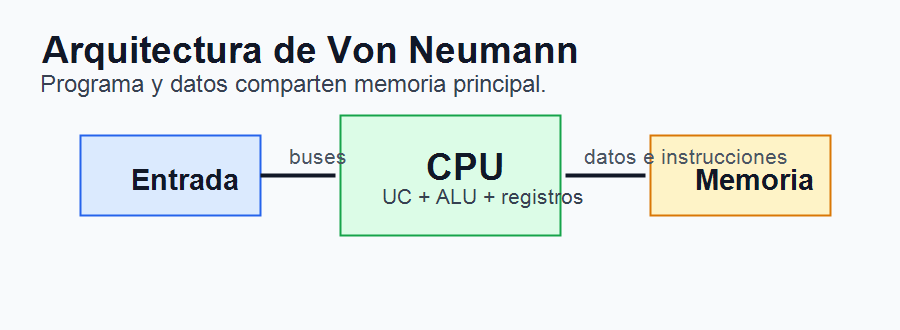
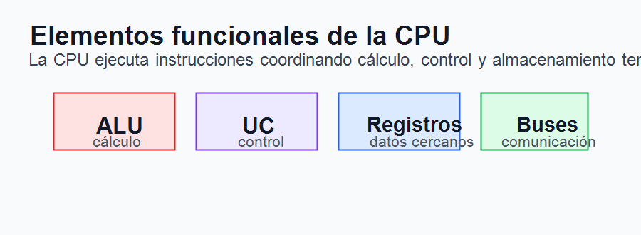
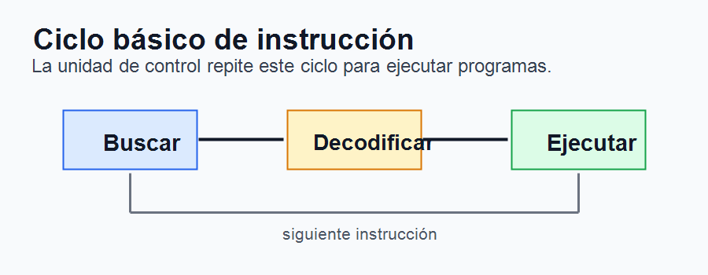
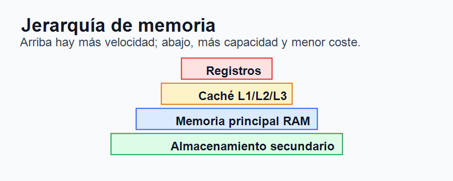
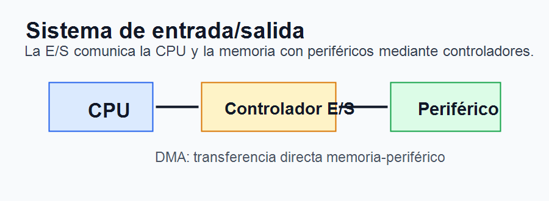

# Tema 2. Elementos funcionales de un ordenador digital

## Índice

1. Introducción.
2. Arquitectura de un computador.
3. Arquitecturas Von Neumann y Harvard.
4. Unidad central de proceso.
5. Ciclo básico de instrucción.
6. Memoria central y jerarquía de memoria.
7. Sistema de entrada/salida.
8. Tendencias actuales.
9. Contextualización.
10. Conclusión.
11. Esquema rápido.

## 1. Introducción

El ordenador digital es una máquina capaz de recibir datos, almacenarlos, procesarlos y producir resultados mediante la ejecución de programas. Su importancia actual es enorme, ya que aparece en la administración, la educación, la industria, la sanidad, las comunicaciones y la vida cotidiana.

Para comprender su funcionamiento no basta con conocer sus componentes físicos. Es necesario estudiar sus elementos funcionales, es decir, las partes que realizan una función dentro del sistema: procesamiento, memoria, comunicación interna y entrada/salida.

La mayoría de los ordenadores actuales se basan en el modelo de programa almacenado, asociado a la arquitectura de Von Neumann. En este modelo, las instrucciones y los datos se almacenan en memoria y son procesados por la unidad central de proceso o CPU. A partir de esta base han surgido mejoras como la memoria caché, la segmentación, los procesadores multinúcleo y las arquitecturas especializadas.

## 2. Arquitectura de un computador

La arquitectura de un computador define la organización funcional visible para el programador y la forma en la que se relacionan sus elementos principales. De manera general, un ordenador digital se compone de:

- Unidad central de proceso o CPU.
- Memoria principal.
- Sistema de entrada/salida.
- Buses de comunicación.
- Periféricos y almacenamiento secundario.

La CPU interpreta y ejecuta instrucciones. La memoria principal almacena datos e instrucciones en uso. La entrada/salida permite comunicarse con el exterior. Los buses transportan datos, direcciones y señales de control entre los distintos elementos.

Estos componentes no actúan de forma aislada. El rendimiento de un ordenador depende del equilibrio entre procesador, memoria, buses y dispositivos de entrada/salida. Un procesador muy rápido puede quedar limitado si la memoria o los accesos a disco son lentos.

## 3. Arquitecturas Von Neumann y Harvard

La arquitectura de Von Neumann, también llamada arquitectura Princeton, se basa en una memoria única para datos e instrucciones. La CPU obtiene de memoria una instrucción, la interpreta, accede a los datos necesarios y ejecuta la operación correspondiente.

Su principal ventaja es la sencillez: datos e instrucciones comparten el mismo espacio de memoria y los mismos mecanismos de acceso. Su principal limitación es el llamado cuello de botella de Von Neumann, ya que CPU y memoria deben intercambiar continuamente instrucciones y datos por los buses.

La arquitectura Harvard separa la memoria de instrucciones y la memoria de datos. Esto permite acceder a ambas de forma simultánea, mejorando el rendimiento en determinados sistemas. Es habitual en microcontroladores, sistemas embebidos y algunas partes internas de procesadores modernos, como las cachés separadas de instrucciones y datos.

En la práctica, muchos sistemas actuales combinan ideas de ambos modelos: mantienen un modelo general de Von Neumann, pero incorporan mejoras internas inspiradas en Harvard.

## 4. Unidad central de proceso

La unidad central de proceso o CPU es el núcleo funcional del ordenador. Su misión es ejecutar instrucciones y coordinar el funcionamiento del sistema. Sus elementos principales son la unidad aritmético-lógica, la unidad de control, los registros y los buses internos.

La unidad aritmético-lógica, o ALU, realiza operaciones aritméticas y lógicas. Entre ellas se encuentran sumas, restas, comparaciones, desplazamientos y operaciones booleanas como AND, OR o NOT. En muchas CPU existe además una unidad de coma flotante o FPU, especializada en operaciones con números reales.

La unidad de control interpreta las instrucciones y genera las señales necesarias para que el resto de componentes actúen de forma coordinada. Controla el flujo de datos, el acceso a memoria, la ejecución de instrucciones y la comunicación con otros elementos del sistema.

Los registros son pequeñas memorias internas de altísima velocidad. Almacenan datos temporales, direcciones o información de control. Entre los registros habituales están el contador de programa, que apunta a la siguiente instrucción; el registro de instrucción, que almacena la instrucción en ejecución; el acumulador; el puntero de pila; y el registro de estado, que guarda indicadores como cero, acarreo, signo o desbordamiento.

Los buses internos permiten comunicar las partes de la CPU. De forma general se distinguen bus de datos, bus de direcciones y bus de control. El bus de datos transporta información; el de direcciones indica posiciones de memoria o dispositivos; y el de control transmite órdenes y señales de sincronización.

## 5. Ciclo básico de instrucción

La ejecución de un programa se basa en la repetición del ciclo de instrucción. Este ciclo permite que la CPU avance instrucción a instrucción.

En primer lugar, la CPU busca la instrucción en memoria, usando la dirección indicada por el contador de programa. Después, la unidad de control decodifica la instrucción para determinar qué operación debe realizarse y qué operandos necesita. Finalmente, la instrucción se ejecuta, se actualizan registros y se prepara la siguiente instrucción.

Este proceso puede optimizarse mediante técnicas como la segmentación o pipeline, que permite solapar varias fases de instrucciones distintas. También existen arquitecturas superescalares, capaces de ejecutar varias instrucciones en paralelo si no existen dependencias entre ellas.

## 6. Memoria central y jerarquía de memoria

La memoria principal almacena los programas y datos que se están utilizando en un momento determinado. Se organiza en celdas identificadas por direcciones. La CPU accede a ellas para leer instrucciones, leer datos o escribir resultados.

La memoria RAM es volátil, es decir, pierde su contenido al apagarse el equipo. Dentro de ella pueden distinguirse tecnologías como DRAM, más usada como memoria principal por su densidad y coste, y SRAM, más rápida y costosa, empleada normalmente en memorias caché.

La jerarquía de memoria intenta equilibrar velocidad, capacidad y coste. En la parte superior están los registros, muy rápidos y pequeños. Después se sitúan las cachés L1, L2 y L3, que almacenan datos e instrucciones usados recientemente. Más abajo aparece la memoria principal RAM y, finalmente, el almacenamiento secundario, como SSD o discos duros.

La memoria caché es esencial para el rendimiento, porque reduce el número de accesos a memoria principal. Se basa en el principio de localidad: los programas suelen reutilizar datos próximos en el tiempo o en el espacio.

## 7. Sistema de entrada/salida

El sistema de entrada/salida permite que el ordenador se comunique con el exterior mediante periféricos. Estos pueden ser de entrada, como teclado, ratón o escáner; de salida, como monitor o impresora; mixtos, como pantallas táctiles; de almacenamiento; o de comunicación, como tarjetas de red.

La E/S se gestiona mediante controladores, que actúan como intermediarios entre la CPU y los dispositivos. Existen varios métodos de comunicación. En la E/S programada, la CPU controla directamente el intercambio de datos, lo que puede ser poco eficiente. En la E/S por interrupciones, el dispositivo avisa a la CPU cuando necesita atención. En el acceso directo a memoria, o DMA, un controlador transfiere datos entre memoria y periférico sin intervención constante de la CPU.

Los sistemas modernos utilizan buses y estándares como USB, PCI Express, SATA, NVMe, HDMI o Ethernet. Su evolución busca mayor velocidad, menor latencia, más eficiencia energética y mejor compatibilidad.

## 8. Tendencias actuales

La arquitectura de computadores ha evolucionado para superar las limitaciones del modelo clásico. Una tendencia fundamental es el uso de procesadores multinúcleo, que integran varias unidades de procesamiento en un mismo chip. También se emplean GPU y aceleradores especializados para gráficos, inteligencia artificial, criptografía o cálculo científico.

Otra línea importante es la mejora de la memoria y el almacenamiento. Las memorias DDR han aumentado velocidad y ancho de banda, mientras que los SSD NVMe reducen notablemente los tiempos de acceso frente a tecnologías anteriores.

También destacan los sistemas embebidos, los dispositivos móviles, la computación en la nube y los centros de datos, donde el rendimiento debe combinarse con eficiencia energética, escalabilidad y seguridad.

Finalmente, la computación cuántica introduce el uso de qubits, aunque todavía no sustituye al ordenador digital clásico. Su interés se centra en problemas concretos de optimización, simulación y criptografía.

## 9. Contextualización

Este tema se relaciona directamente con la especialidad de Sistemas y Aplicaciones Informáticas, ya que sirve de base para comprender sistemas operativos, montaje de equipos, redes, seguridad, programación y bases de datos.

En Formación Profesional puede conectarse con ciclos como Sistemas Microinformáticos y Redes, Administración de Sistemas Informáticos en Red, Desarrollo de Aplicaciones Multiplataforma y Desarrollo de Aplicaciones Web. Entender la estructura funcional de un ordenador ayuda al alumnado a diagnosticar problemas, interpretar especificaciones técnicas y tomar decisiones sobre hardware y rendimiento.

Desde el punto de vista normativo, puede relacionarse con la Ley Orgánica 3/2022 y el Real Decreto 659/2023, que impulsan una Formación Profesional actualizada, conectada con la digitalización, la innovación y las necesidades del sistema productivo.

## 10. Conclusión

Los elementos funcionales de un ordenador digital permiten explicar cómo una máquina ejecuta programas y procesa información. La CPU actúa como núcleo de procesamiento; la memoria almacena datos e instrucciones; los buses permiten la comunicación interna; y el sistema de entrada/salida conecta el ordenador con el exterior.

El modelo de Von Neumann sigue siendo la base conceptual de la mayoría de ordenadores actuales, aunque se ha enriquecido con técnicas como cachés, segmentación, paralelismo, multinúcleo y aceleradores especializados. Del mismo modo, la jerarquía de memoria y los sistemas de E/S son fundamentales para evitar cuellos de botella.

En definitiva, conocer estos elementos no solo permite comprender la arquitectura interna del ordenador, sino también interpretar su rendimiento, diagnosticar problemas y relacionar hardware y software de forma profesional.

## 11. Esquema rápido

1. Ordenador digital: recibe, procesa, almacena y comunica datos.
2. Arquitectura: CPU, memoria, E/S y buses.
3. Von Neumann: memoria única para datos e instrucciones.
4. Harvard: memorias separadas para datos e instrucciones.
5. CPU: ALU, FPU, UC, registros y buses internos.
6. Ciclo de instrucción: buscar, decodificar y ejecutar.
7. Memoria: registros, caché, RAM y almacenamiento.
8. E/S: controladores, interrupciones y DMA.
9. Tendencias: multinúcleo, GPU, SSD NVMe, nube y computación cuántica.
