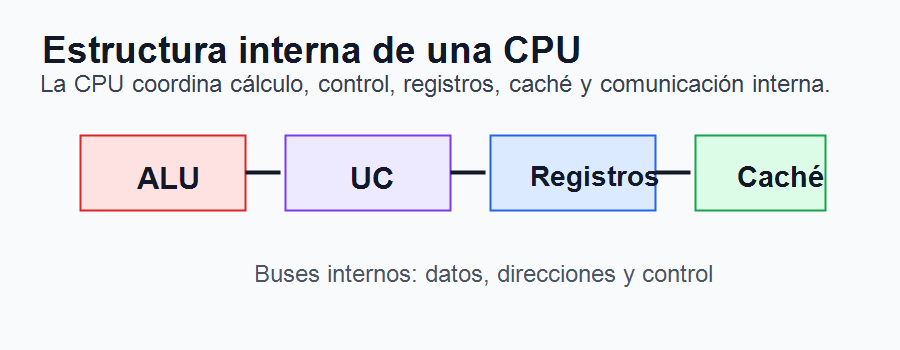
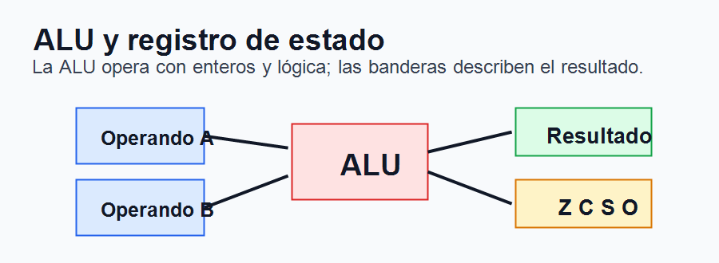
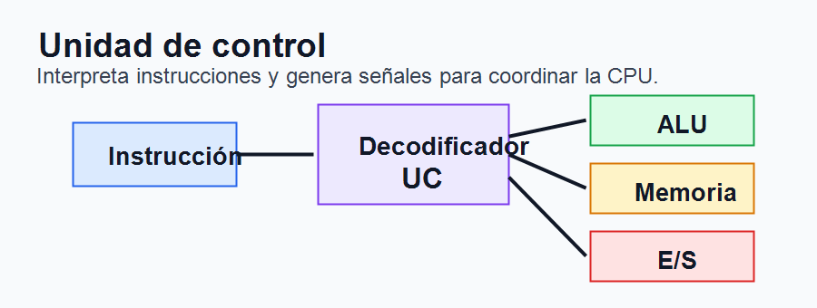
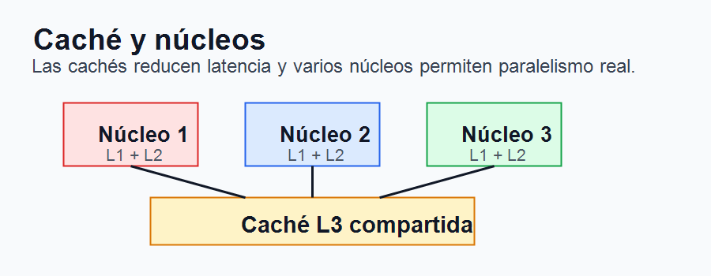
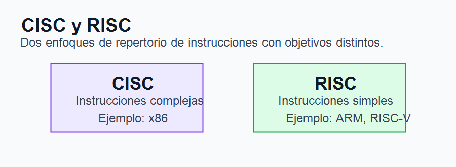

# Tema 3. Componentes, estructura y funcionamiento de la unidad central de proceso

## Índice

1. Introducción.
2. La CPU dentro de la arquitectura del computador.
3. Componentes internos de la CPU.
4. Unidad aritmético-lógica y unidad de coma flotante.
5. Unidad de control y registros.
6. Buses, memoria caché y núcleos.
7. Funcionamiento de la CPU.
8. Arquitecturas CISC, RISC y ARM.
9. Paralelismo y técnicas de mejora del rendimiento.
10. Tendencias actuales.
11. Contextualización.
12. Conclusión.
13. Esquema rápido.

## 1. Introducción

La unidad central de proceso, o CPU, es el componente encargado de ejecutar las instrucciones que forman los programas. Actúa como núcleo funcional del ordenador, ya que interpreta órdenes, realiza operaciones, coordina el movimiento de datos y controla la interacción con memoria y dispositivos.

Aunque en el lenguaje cotidiano se identifica la CPU con el “procesador”, desde el punto de vista funcional conviene entenderla como un conjunto de unidades internas: unidad aritmético-lógica, unidad de control, registros, buses, cachés y, en procesadores modernos, varios núcleos y unidades especializadas.

Este tema se centra en los componentes, estructura y funcionamiento de la CPU, así como en las principales técnicas empleadas para mejorar su rendimiento: caché, segmentación, paralelismo, arquitecturas superescalares, multinúcleo y distintos repertorios de instrucciones.

## 2. La CPU dentro de la arquitectura del computador

La CPU forma parte de la arquitectura general del computador, junto con la memoria principal, el sistema de entrada/salida y los buses. En el modelo clásico de Von Neumann, datos e instrucciones comparten una memoria común. La CPU lee una instrucción, la interpreta, accede a los operandos necesarios y ejecuta la operación.

La arquitectura Harvard separa memoria de datos y memoria de instrucciones, lo que permite acceder a ambas simultáneamente. Aunque los ordenadores generales suelen seguir un modelo Von Neumann, muchos procesadores actuales incorporan ideas Harvard en su diseño interno, por ejemplo mediante cachés separadas de instrucciones y datos en el primer nivel.

La CPU no trabaja aislada: su rendimiento depende de la velocidad de la memoria, del ancho de los buses, de la eficiencia de la caché y de la capacidad de ejecutar instrucciones sin esperas innecesarias.

## 3. Componentes internos de la CPU

Una CPU moderna integra varios bloques funcionales que cooperan entre sí. Los más importantes son la unidad aritmético-lógica, la unidad de coma flotante, la unidad de control, los registros, los buses internos, la memoria caché y los núcleos de ejecución.

La unidad aritmético-lógica realiza operaciones con enteros y operaciones lógicas. La unidad de control dirige la ejecución. Los registros almacenan datos temporales de acceso inmediato. Los buses internos transportan datos, direcciones y señales de control. La caché reduce el tiempo de acceso a memoria. Los núcleos permiten ejecutar varias tareas o hilos de forma paralela.

El diseño concreto depende de la familia de procesadores, del uso previsto y de criterios como consumo, coste, rendimiento, compatibilidad y disipación térmica.

## 4. Unidad aritmético-lógica y unidad de coma flotante

La unidad aritmético-lógica, conocida como ALU, es el bloque encargado de realizar operaciones aritméticas y lógicas. Entre las operaciones aritméticas destacan suma, resta, incrementos, decrementos y comparaciones. Entre las lógicas aparecen AND, OR, NOT, XOR y desplazamientos de bits.

La ALU trabaja normalmente con operandos almacenados en registros. Tras realizar la operación, deposita el resultado en otro registro y actualiza el registro de estado. Este registro contiene indicadores o banderas, como cero, signo, acarreo o desbordamiento, que permiten tomar decisiones en instrucciones condicionales.

La unidad de coma flotante, o FPU, está especializada en operaciones con números reales. Aunque una ALU podría simular estas operaciones mediante software, el coste sería mucho mayor. Por ello, los procesadores modernos integran unidades específicas para cálculo en coma flotante, muy importantes en gráficos, simulación, ingeniería, inteligencia artificial y cálculo científico.

## 5. Unidad de control y registros

La unidad de control es el bloque que coordina el funcionamiento de la CPU. Interpreta las instrucciones y genera las señales necesarias para mover datos, activar la ALU, leer o escribir memoria y actualizar registros.

Puede diseñarse mediante lógica cableada o lógica microprogramada. La lógica cableada utiliza circuitos específicos, por lo que suele ser rápida, pero menos flexible. La lógica microprogramada interpreta cada instrucción como una secuencia de microinstrucciones internas, facilitando la implementación de instrucciones complejas.

Los registros son memorias internas muy rápidas. Entre los principales se encuentran el contador de programa, que contiene la dirección de la siguiente instrucción; el registro de instrucción, que almacena la instrucción actual; el acumulador o registros de propósito general; el puntero de pila; y el registro de estado.

Gracias a los registros, la CPU evita acceder constantemente a la memoria principal, que es mucho más lenta. Por eso, aunque su capacidad es pequeña, su papel es esencial en el rendimiento.

## 6. Buses, memoria caché y núcleos

Los buses internos comunican los distintos bloques de la CPU. Se suele distinguir entre bus de datos, bus de direcciones y bus de control. El bus de datos transporta operandos e instrucciones; el de direcciones indica posiciones de memoria; y el de control transmite órdenes y sincronización.

La memoria caché es una memoria muy rápida situada entre la CPU y la memoria principal. Su misión es almacenar datos e instrucciones usados recientemente o que probablemente se usarán pronto. Se basa en el principio de localidad temporal y espacial.

Las cachés suelen organizarse en niveles. L1 es la más próxima y rápida, a menudo separada en instrucciones y datos. L2 tiene más capacidad y algo más de latencia. L3 suele estar compartida entre varios núcleos. Esta organización intenta equilibrar velocidad, capacidad y coste.

Los procesadores actuales incorporan varios núcleos. Cada núcleo puede ejecutar instrucciones de forma independiente, lo que permite paralelismo real. Además, algunos diseños combinan núcleos de alto rendimiento con núcleos de eficiencia para adaptar consumo y potencia a cada tarea.

## 7. Funcionamiento de la CPU

El funcionamiento básico de la CPU se basa en el ciclo de instrucción. En primer lugar se busca la instrucción en memoria, operación conocida como fetch. Después se decodifica para determinar qué debe hacerse. A continuación se ejecuta la operación, se accede a memoria si es necesario y se escribe el resultado.

Durante este proceso intervienen el contador de programa, la unidad de control, los registros, la ALU y los buses. Si se produce una interrupción, la CPU puede suspender temporalmente el flujo normal para atender un evento externo o interno, como una petición de entrada/salida, un temporizador o una excepción.

Este ciclo se repite continuamente mientras el sistema está en funcionamiento. La eficiencia consiste en reducir esperas, aprovechar las unidades disponibles y mantener alimentada la CPU con instrucciones y datos.

## 8. Arquitecturas CISC, RISC y ARM

El repertorio de instrucciones define el conjunto de órdenes que una CPU puede interpretar. Existen dos enfoques clásicos: CISC y RISC.

CISC, Complex Instruction Set Computing, se caracteriza por instrucciones numerosas y complejas. Es el enfoque asociado históricamente a la arquitectura x86, utilizada por fabricantes como Intel y AMD. Su ventaja es la compatibilidad y la capacidad de realizar operaciones complejas con menos instrucciones visibles.

RISC, Reduced Instruction Set Computing, apuesta por instrucciones más simples, regulares y rápidas de decodificar. ARM y RISC-V son ejemplos relevantes. ARM destaca en dispositivos móviles, sistemas embebidos y equipos de bajo consumo, aunque también ha ganado presencia en ordenadores personales y servidores. RISC-V, por su parte, es una arquitectura abierta con creciente interés académico e industrial.

En la práctica, la diferencia se ha difuminado: muchos procesadores CISC traducen internamente instrucciones complejas en microoperaciones más simples, próximas a un enfoque RISC.

## 9. Paralelismo y técnicas de mejora del rendimiento

El aumento de rendimiento no depende solo de subir la frecuencia de reloj. También se consigue mediante técnicas de paralelismo y mejor aprovechamiento interno.

La canalización, o pipelining, divide la ejecución de instrucciones en etapas, como búsqueda, decodificación, ejecución, acceso a memoria y escritura de resultado. Así, varias instrucciones pueden encontrarse simultáneamente en fases distintas.

Las arquitecturas superescalares incorporan varias unidades de ejecución y pueden emitir más de una instrucción por ciclo si no existen dependencias. También se emplean predicción de saltos, ejecución fuera de orden, renombrado de registros y ejecución especulativa, aunque estas técnicas aumentan la complejidad del procesador.

El paralelismo también aparece a nivel de núcleo, mediante procesadores multinúcleo; a nivel de hilo, mediante multithreading; y a nivel vectorial, mediante instrucciones SIMD, capaces de aplicar una operación sobre varios datos a la vez.

## 10. Tendencias actuales

Las tendencias actuales buscan más rendimiento con menor consumo. Destacan los procesadores multinúcleo, los diseños híbridos con núcleos de rendimiento y eficiencia, las GPU para cálculo masivamente paralelo, y los aceleradores específicos para inteligencia artificial, cifrado, vídeo o comunicaciones.

También se observa una evolución hacia diseños modulares mediante chiplets, que permiten combinar varios bloques de silicio en un mismo encapsulado. Esto mejora la escalabilidad y puede reducir costes de fabricación.

En servidores y supercomputación se priorizan el paralelismo, el ancho de banda de memoria, la interconexión y la eficiencia energética. La computación cuántica, aunque no sustituye a la CPU clásica, representa una línea complementaria para ciertos problemas de simulación, optimización y criptografía.

## 11. Contextualización

Este tema se relaciona directamente con la especialidad de Sistemas y Aplicaciones Informáticas. Comprender la CPU permite interpretar el rendimiento de sistemas operativos, aplicaciones, bases de datos, redes, virtualización y seguridad.

En Formación Profesional conecta con módulos como Montaje y Mantenimiento de Equipos, Sistemas Informáticos, Fundamentos de Hardware y Sistemas Operativos. También permite explicar al alumnado por qué influyen factores como número de núcleos, caché, frecuencia, arquitectura, consumo o tipo de carga de trabajo.

Puede vincularse con la Ley Orgánica 3/2022 y el Real Decreto 659/2023, que impulsan una Formación Profesional actualizada, conectada con la digitalización y con las necesidades del sistema productivo.

## 12. Conclusión

La CPU es el elemento central del procesamiento en un ordenador digital. Está formada por unidades especializadas que cooperan para ejecutar instrucciones: ALU, FPU, unidad de control, registros, buses, cachés y núcleos.

Su funcionamiento se basa en el ciclo de instrucción, pero los procesadores modernos incorporan numerosas técnicas para aumentar el rendimiento: caché multinivel, canalización, ejecución superescalar, predicción, multinúcleo, SIMD y aceleradores especializados.

Por tanto, conocer la estructura y funcionamiento de la CPU permite comprender cómo se ejecutan los programas, por qué aparecen cuellos de botella y cómo se relacionan hardware y software. Es un contenido esencial para cualquier profesional de la informática.

## 13. Esquema rápido

1. CPU: ejecuta instrucciones y coordina el sistema.
2. Componentes: ALU, FPU, UC, registros, buses, caché y núcleos.
3. ALU: operaciones aritméticas y lógicas.
4. UC: decodifica instrucciones y genera señales de control.
5. Registros: almacenamiento interno muy rápido.
6. Caché: reduce accesos a memoria principal.
7. Funcionamiento: buscar, decodificar, ejecutar y escribir.
8. CISC/RISC: instrucciones complejas frente a simples.
9. Rendimiento: pipeline, superescalar, multinúcleo, SIMD y aceleradores.
