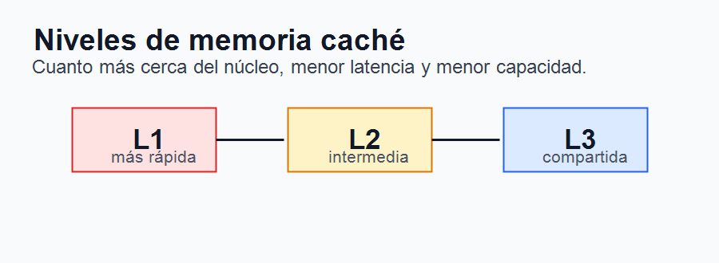
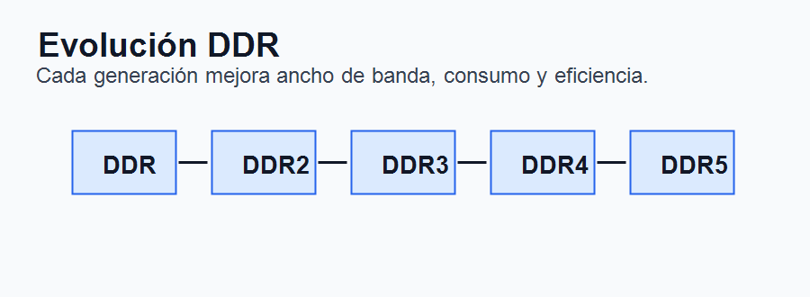

# Tema 4. Memoria interna: tipos, direccionamiento, características y funciones

## Índice

1. Introducción.
2. Función de la memoria y jerarquía.
3. Memoria interna.
4. Registros del procesador.
5. Memoria caché.
6. Memoria principal o RAM.
7. Direccionamiento de memoria.
8. Características de las memorias.
9. Tipos de memoria: volátiles y no volátiles.
10. Tendencias actuales.
11. Contextualización.
12. Conclusión.
13. Esquema rápido.

## 1. Introducción

La memoria interna es uno de los componentes fundamentales de cualquier sistema informático. Su función principal es almacenar datos e instrucciones para que puedan ser utilizados por el procesador durante la ejecución de los programas. Sin memoria, la CPU no tendría un espacio de trabajo desde el que leer instrucciones ni donde guardar resultados intermedios.

La evolución de la memoria ha condicionado directamente el desarrollo del hardware y del software. A medida que los programas se han vuelto más complejos, han aumentado las necesidades de capacidad, velocidad, ancho de banda y eficiencia energética. Por ello, el estudio de la memoria interna resulta imprescindible para comprender el rendimiento global de un ordenador.

En este tema se analizan la función y jerarquía de la memoria, los principales tipos de memoria interna, los mecanismos de direccionamiento, sus características técnicas y las tendencias actuales.

## 2. Función de la memoria y jerarquía

La memoria tiene dos funciones básicas: almacenar información y permitir su lectura o escritura por parte del sistema. Esta información puede estar formada por instrucciones de programa, datos de usuario, direcciones, resultados intermedios o información de control.

El problema fundamental es que no existe una memoria que sea simultáneamente muy rápida, muy barata y de enorme capacidad. Por este motivo, los sistemas informáticos organizan la memoria en una jerarquía.

En la parte superior se encuentran los registros del procesador, muy rápidos pero de capacidad reducida. Después aparece la memoria caché, que reduce los accesos a la memoria principal. La RAM actúa como memoria de trabajo del sistema. Por debajo se sitúa el almacenamiento secundario, como SSD o discos duros, y finalmente sistemas de respaldo o archivo.

Esta jerarquía busca equilibrar velocidad, capacidad y coste. Los datos más usados se mantienen en los niveles superiores, mientras que los menos frecuentes permanecen en niveles más lentos y de mayor capacidad.

## 3. Memoria interna

La memoria interna comprende aquellos elementos de almacenamiento directamente relacionados con la ejecución de instrucciones por parte del procesador. Incluye registros, caché y memoria principal. Aunque el almacenamiento secundario también guarda información, no se considera memoria interna en sentido estricto, porque no participa con la misma inmediatez en la ejecución.

Las memorias internas se fabrican principalmente con tecnología de semiconductores, utilizando transistores, condensadores y circuitos integrados. Su diseño intenta maximizar velocidad, fiabilidad, densidad y eficiencia energética.

La memoria interna es esencial porque evita que la CPU dependa continuamente de dispositivos externos mucho más lentos. Su organización influye en la rapidez de carga de programas, la multitarea, el rendimiento de aplicaciones y la respuesta general del sistema.

## 4. Registros del procesador

Los registros son pequeñas unidades de almacenamiento situadas dentro de la CPU. Constituyen el nivel más rápido de la jerarquía de memoria, aunque su capacidad es muy limitada.

Almacenan operandos, direcciones, instrucciones o resultados temporales. Algunos registros son de propósito general y otros tienen funciones específicas, como el contador de programa, el puntero de pila, el registro de instrucción o el registro de estado.

El tamaño de los registros está relacionado con la arquitectura del procesador. Por ejemplo, en una arquitectura de 64 bits, los registros pueden manejar palabras de 64 bits, lo que condiciona el direccionamiento y la capacidad de operación del sistema.

## 5. Memoria caché

La memoria caché es una memoria rápida situada entre la CPU y la memoria principal. Su objetivo es reducir la latencia de acceso a datos e instrucciones usados con frecuencia.

La caché se basa en el principio de localidad. La localidad temporal indica que un dato usado recientemente probablemente volverá a usarse. La localidad espacial indica que, si se accede a una posición de memoria, es probable que se acceda pronto a posiciones cercanas.

Normalmente se organiza en niveles. La caché L1 es la más próxima al núcleo y la más rápida, pero también la más pequeña. Suele dividirse en caché de instrucciones y caché de datos. La L2 tiene mayor capacidad y algo más de latencia. La L3 suele ser compartida entre varios núcleos y tiene mayor tamaño.

Una buena organización de caché mejora notablemente el rendimiento, ya que evita que el procesador tenga que esperar continuamente a la RAM.

## 6. Memoria principal o RAM

La memoria principal, o RAM, es el espacio donde se cargan los programas y datos que están en uso. Es una memoria de lectura y escritura, volátil, lo que significa que pierde su contenido al apagar el equipo.

Un módulo de RAM incluye chips de memoria, pistas de conexión, contactos eléctricos, información SPD y, en memorias síncronas, coordinación con el reloj del sistema. La placa base se comunica con la RAM mediante canales y buses de memoria.

La RAM actual suele basarse en tecnología DRAM, porque permite grandes capacidades a coste razonable. Sin embargo, necesita refresco periódico para mantener los datos. La memoria SRAM, más rápida y costosa, se reserva normalmente para cachés.

La cantidad de RAM condiciona la multitarea y la capacidad de ejecutar aplicaciones complejas. La velocidad y la latencia influyen en el rendimiento, especialmente en sistemas con procesadores rápidos, gráficos integrados o cargas intensivas de datos.

## 7. Direccionamiento de memoria

El direccionamiento permite identificar una posición concreta de memoria para leer o escribir información. Cada celda o conjunto de celdas se asocia a una dirección, que el procesador puede utilizar para acceder al dato.

En memorias sencillas puede emplearse direccionamiento cableado, donde las celdas se seleccionan mediante señales eléctricas directas. En memorias organizadas en matrices se emplean esquemas bidimensionales, con filas y columnas. En memorias de gran capacidad pueden aparecer estructuras más complejas, con bancos, planos o apilamiento tridimensional.

También existen memorias asociativas o CAM, Content Addressable Memory, que permiten buscar por contenido en lugar de por dirección. Son útiles en cachés, tablas de traducción de direcciones y dispositivos de red, aunque tienen mayor coste y complejidad.

## 8. Características de las memorias

Las principales características de una memoria son capacidad, velocidad, latencia, volatilidad, coste, consumo y modo de acceso.

La capacidad indica cuánta información puede almacenar, normalmente medida en bytes y sus múltiplos. La velocidad se relaciona con el ancho de banda, es decir, la cantidad de datos que puede transferir por unidad de tiempo. La latencia mide el retardo desde que se solicita un dato hasta que está disponible.

La volatilidad indica si la información se conserva al cortar la alimentación eléctrica. Las memorias volátiles, como la RAM, pierden los datos; las no volátiles, como ROM o Flash, los conservan.

El modo de acceso también es relevante. Puede ser secuencial, cuando los datos se leen en orden; aleatorio, cuando se puede acceder directamente a cualquier posición; o asociativo, cuando se busca por contenido. En memoria interna predomina el acceso aleatorio.

## 9. Tipos de memoria: volátiles y no volátiles

Una clasificación fundamental distingue entre memorias volátiles y no volátiles.

Las memorias volátiles necesitan alimentación para conservar los datos. La SRAM almacena cada bit mediante biestables, es muy rápida y no requiere refresco, pero resulta cara y ocupa más espacio. Por ello se usa en cachés. La DRAM almacena cada bit mediante un condensador, necesita refresco periódico, pero permite mayor densidad y menor coste, por lo que se emplea como RAM principal.

Las memorias no volátiles conservan la información sin alimentación. La ROM almacena datos permanentes. La PROM puede programarse una sola vez. La EPROM puede borrarse con luz ultravioleta. La EEPROM puede borrarse eléctricamente. La memoria Flash, derivada de la EEPROM, permite borrado y escritura por bloques y se utiliza en firmware, BIOS/UEFI, unidades SSD, tarjetas de memoria y dispositivos USB.

Dentro de la evolución de la RAM destacan las memorias DDR, Double Data Rate, que transfieren datos en ambos flancos del ciclo de reloj.

Cada generación, desde DDR hasta DDR5, ha mejorado ancho de banda, consumo y eficiencia, aunque también ha introducido cambios eléctricos y físicos que impiden la compatibilidad directa entre módulos de distintas generaciones.

## 10. Tendencias actuales

Las tendencias actuales buscan mayor ancho de banda, menor consumo y mejor integración. DDR5 mejora la eficiencia y permite mayores velocidades. HBM, High Bandwidth Memory, utiliza apilamiento 3D y conexiones de gran ancho de banda, siendo habitual en GPU, aceleradores de inteligencia artificial y sistemas de alto rendimiento.

También destacan las memorias GDDR usadas en tarjetas gráficas, optimizadas para transferencias masivas. En almacenamiento no volátil, las tecnologías Flash y NVMe han reducido mucho los tiempos de acceso respecto a discos tradicionales.

Otra tendencia es acercar la memoria al procesador o incluso integrarla en el mismo encapsulado, reduciendo latencias y aumentando el rendimiento.

## 11. Contextualización

Este tema se relaciona directamente con la especialidad de Sistemas y Aplicaciones Informáticas. La memoria interna aparece en arquitectura de computadores, montaje de equipos, sistemas operativos, bases de datos, virtualización, programación y rendimiento de aplicaciones.

En Formación Profesional conecta con módulos como Montaje y Mantenimiento de Equipos, Fundamentos de Hardware, Sistemas Informáticos y Sistemas Operativos. Permite al alumnado comprender por qué influyen la cantidad de RAM, la latencia, la caché o la generación DDR en el rendimiento real de un equipo.

También puede relacionarse con la Ley Orgánica 3/2022 y el Real Decreto 659/2023, que impulsan una Formación Profesional actualizada y vinculada a la digitalización.

## 12. Conclusión

La memoria interna es un elemento esencial del ordenador, porque proporciona a la CPU los datos e instrucciones necesarios para ejecutar programas. Su organización jerárquica permite equilibrar velocidad, capacidad y coste.

Los registros ofrecen máxima velocidad, la caché reduce accesos a RAM, y la memoria principal actúa como espacio de trabajo del sistema. Además, los distintos mecanismos de direccionamiento y los tipos de memoria permiten adaptar la tecnología a necesidades concretas.

En definitiva, comprender la memoria interna ayuda a explicar gran parte del rendimiento de un sistema informático y permite tomar decisiones técnicas adecuadas sobre ampliación, configuración y diagnóstico de equipos.

## 13. Esquema rápido

1. Memoria interna: registros, caché y RAM.
2. Función: almacenar datos e instrucciones en uso.
3. Jerarquía: más velocidad arriba, más capacidad abajo.
4. Registros: memoria interna de la CPU.
5. Caché: L1, L2 y L3; reduce latencia.
6. RAM: memoria principal, volátil y de lectura/escritura.
7. Direccionamiento: cableado, 2D, 3D y asociativo.
8. Características: capacidad, velocidad, latencia, coste y volatilidad.
9. Tipos: SRAM, DRAM, ROM, EEPROM y Flash.
10. Tendencias: DDR5, HBM, GDDR, NVMe e integración memoria-procesador.
