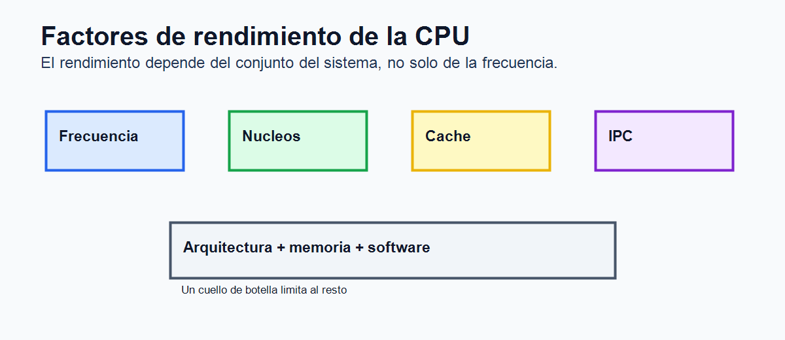

# Tema 5. Microprocesadores

## Índice

1. Introducción. 2. Concepto de microprocesador. 3. Estructura interna. 4. Ciclo de instrucción. 5. Características técnicas. 6. Memoria caché y rendimiento. 7. Arquitecturas y tipos de procesadores. 8. Comunicación con el sistema. 9. Evolución y tendencias. 10. Seguridad y fiabilidad. 11. Contextualización. 12. Conclusión. 13. Esquema rápido.

## 1. Introducción

El microprocesador es uno de los componentes fundamentales de cualquier sistema informático. En él se integra la unidad central de proceso, encargada de interpretar instrucciones, realizar operaciones, coordinar el resto de elementos del ordenador y controlar el flujo de datos entre memoria, buses y periféricos. Su importancia es doble: por un lado, determina gran parte de la capacidad de proceso de un equipo; por otro, condiciona la elección de placa base, memoria, refrigeración, fuente de alimentación y sistema operativo.

Desde los primeros microprocesadores comerciales hasta los modelos actuales, su evolución ha sido constante. Al principio se buscaba aumentar la frecuencia de reloj y la longitud de palabra; posteriormente se incorporaron memorias caché, ejecución segmentada, unidades de coma flotante, varios niveles de paralelismo y, finalmente, varios núcleos dentro del mismo encapsulado. Hoy se habla de procesadores multinúcleo, arquitecturas híbridas, chiplets, aceleradores de inteligencia artificial y diseños orientados a eficiencia energética.

Comprender el microprocesador no consiste solo en memorizar características comerciales. Es necesario relacionar su funcionamiento interno con el rendimiento real del sistema. Un procesador rápido puede verse limitado por una memoria lenta, un almacenamiento insuficiente, mala refrigeración o software no optimizado. Por ello, el análisis debe ser global.

## 2. Concepto de microprocesador

Un microprocesador es un circuito integrado programable que ejecuta instrucciones codificadas en lenguaje máquina. Recibe datos, los procesa de acuerdo con un programa y genera resultados. A diferencia de otros circuitos electrónicos fijos, su comportamiento depende de las instrucciones que ejecuta, lo que le proporciona gran flexibilidad.

Desde el punto de vista funcional, forma parte de la CPU o unidad central de proceso. En los ordenadores actuales suele incorporar, además del núcleo de ejecución, controladores de memoria, gráficos integrados, buses de alta velocidad y elementos de gestión energética. En sistemas embebidos puede estar integrado en un microcontrolador, junto a memoria y periféricos de entrada/salida.

La información que maneja se representa en binario. Las instrucciones indican operaciones como sumar, comparar, mover datos, saltar a otra parte del programa o acceder a memoria. Para ejecutarlas, el procesador necesita registros internos, unidad de control, ALU, buses y mecanismos de sincronización.

## 3. Estructura interna

La estructura de un microprocesador puede estudiarse mediante sus bloques principales: unidad de control, unidad aritmético-lógica, unidad de coma flotante, registros, buses internos y memoria caché.

La unidad de control dirige el funcionamiento del procesador. Interpreta las instrucciones y genera señales para activar la lectura de memoria, el movimiento de datos, el uso de la ALU o la escritura de resultados. La ALU realiza operaciones aritméticas con enteros y operaciones lógicas como AND, OR, NOT o XOR. La FPU se especializa en números reales, esenciales en gráficos, simulación, cálculo científico o inteligencia artificial.

Los registros son pequeñas memorias internas de acceso muy rápido. Algunos almacenan datos temporales; otros tienen funciones específicas, como el contador de programa, que apunta a la siguiente instrucción, o el registro de instrucción, que contiene la instrucción en ejecución. También existen registros de estado, con banderas de cero, signo, acarreo o desbordamiento.

La caché reduce la diferencia de velocidad entre procesador y memoria principal. Sin ella, muchos ciclos se perderían esperando datos. Por último, los buses internos conectan los bloques y permiten transferir instrucciones, direcciones, datos y señales de control.

## 4. Ciclo de instrucción

El funcionamiento básico de un procesador se resume en el ciclo de instrucción: búsqueda, decodificación y ejecución. Primero se obtiene de memoria la instrucción indicada por el contador de programa. Después se decodifica para saber qué operación debe realizarse y con qué operandos. Finalmente se ejecuta, se actualizan registros y se prepara la siguiente instrucción.

Este esquema básico se complica en procesadores modernos. Para mejorar el rendimiento se usa segmentación o pipeline, que divide la ejecución en etapas. Mientras una instrucción se ejecuta, otra puede estar decodificándose y otra siendo leída. También se emplea ejecución fuera de orden, predicción de saltos y ejecución especulativa, técnicas que intentan aprovechar al máximo las unidades internas.

Estas mejoras aumentan el rendimiento, pero también la complejidad. Si la predicción falla o aparece una dependencia entre instrucciones, el procesador debe corregir el flujo y puede perder ciclos. Por ello, el rendimiento real depende de la arquitectura y del tipo de programa.

## 5. Características técnicas

Entre las características principales de un microprocesador destacan la longitud de palabra, frecuencia, número de núcleos, número de hilos, tamaño de caché, proceso de fabricación, consumo, temperatura máxima, socket, conjunto de instrucciones e IPC.

La longitud de palabra indica el tamaño de datos que el procesador maneja de forma natural, como 32 o 64 bits. La frecuencia, medida en GHz, indica ciclos por segundo, aunque no permite comparar por sí sola procesadores de arquitecturas distintas. El IPC, instrucciones por ciclo, expresa cuánto trabajo útil se realiza en cada ciclo y es clave para entender por qué dos procesadores con la misma frecuencia pueden rendir de forma diferente.

El número de núcleos permite ejecutar tareas en paralelo. Cada núcleo puede trabajar con un hilo de ejecución, y tecnologías como SMT o HyperThreading permiten que un núcleo gestione más de un hilo lógico. Esto mejora el rendimiento en aplicaciones paralelizables, aunque no duplica automáticamente la potencia.

El proceso de fabricación, expresado en nanómetros, se relaciona con densidad de transistores, consumo y disipación térmica. Procesos más avanzados permiten integrar más elementos y reducir consumo, pero también exigen diseños más complejos.

## 6. Memoria caché y rendimiento

La memoria caché es una memoria pequeña y rápida situada cerca del núcleo. Suele organizarse en niveles: L1, L2 y L3. La L1 es la más rápida y reducida; la L2 ofrece más capacidad; la L3 suele estar compartida entre varios núcleos. Su objetivo es almacenar instrucciones y datos usados recientemente o con alta probabilidad de reutilización.

El rendimiento del procesador depende de múltiples factores: frecuencia, IPC, núcleos, caché, ancho de banda de memoria, latencia, paralelismo del software y eficiencia energética. En equipos reales también influyen refrigeración, placa base, fuente y configuración del sistema operativo.

Las instrucciones SIMD permiten aplicar una operación a varios datos simultáneamente, útil en multimedia, compresión, cifrado, gráficos y cálculo científico. Las extensiones criptográficas aceleran algoritmos de seguridad. Los modos turbo elevan temporalmente la frecuencia si hay margen térmico y eléctrico.

El overclocking consiste en aumentar la frecuencia por encima de la especificación del fabricante. Puede mejorar el rendimiento, pero también incrementar consumo, temperatura e inestabilidad. En entornos profesionales suele preferirse estabilidad y fiabilidad antes que rendimiento extremo.

## 7. Arquitecturas y tipos de procesadores

Una clasificación clásica distingue entre arquitecturas CISC y RISC. CISC, asociada históricamente a x86, utiliza instrucciones complejas y mantiene gran compatibilidad con software antiguo. RISC emplea instrucciones más simples y regulares, frecuentes en ARM y RISC-V, lo que facilita diseños eficientes.

Según su finalidad existen procesadores de escritorio, portátiles, servidores, móviles, embebidos, DSP, GPU y microcontroladores. Los de escritorio buscan equilibrio entre rendimiento y coste. Los de portátil priorizan consumo y temperatura. Los de servidor incorporan muchos núcleos, gran capacidad de memoria, virtualización avanzada y funciones de fiabilidad. Los móviles buscan máxima eficiencia energética. Los microcontroladores integran CPU, memoria y periféricos para controlar dispositivos concretos.

También se distinguen por encapsulado y conexión con la placa: PGA, LGA, BGA o soluciones soldadas. El socket condiciona la compatibilidad con placa base y refrigeración. En equipos comerciales, elegir CPU exige comprobar socket, chipset, BIOS/UEFI, memoria admitida y consumo.

## 8. Comunicación con el sistema

El microprocesador no trabaja de forma aislada. Se comunica con memoria, chipset, tarjeta gráfica, almacenamiento y periféricos mediante buses e interfaces. Tradicionalmente se hablaba de bus de datos, bus de direcciones y bus de control. En sistemas actuales predominan enlaces punto a punto y buses de alta velocidad como PCI Express.

El controlador de memoria suele estar integrado en la CPU, lo que reduce latencia. La comunicación con tarjetas gráficas y SSD NVMe se realiza mediante líneas PCIe. El chipset o conjunto de apoyo gestiona puertos USB, SATA, red, audio y otras funciones de la placa.

Un sistema equilibrado evita cuellos de botella. Un procesador potente puede rendir mal con poca RAM, almacenamiento lento o refrigeración deficiente. Por ello, el análisis técnico debe considerar el conjunto completo.

## 9. Evolución y tendencias

La evolución de los microprocesadores ha pasado de aumentar frecuencia a mejorar paralelismo, eficiencia e integración. Hoy destacan arquitecturas multinúcleo, diseños híbridos con núcleos de rendimiento y eficiencia, fabricación mediante chiplets, integración de GPU y aceleradores específicos.

Los chiplets permiten combinar varios bloques dentro del mismo encapsulado, mejorar rendimiento y reducir costes de fabricación. ARM gana presencia por su eficiencia en móviles, portátiles y servidores. RISC-V despierta interés por su carácter abierto. También crecen los aceleradores de IA, capaces de realizar operaciones matriciales con menor consumo.

Otra tendencia importante es la eficiencia energética. En centros de datos, portátiles y dispositivos móviles, consumir menos significa reducir calor, ruido y coste operativo.

## 10. Seguridad y fiabilidad

Los microprocesadores también presentan riesgos de seguridad. Vulnerabilidades como Spectre y Meltdown demostraron que técnicas de rendimiento, como ejecución especulativa y predicción de saltos, podían filtrar información. Las soluciones combinan cambios de hardware, actualizaciones de microcódigo, parches del sistema operativo y compiladores.

La fiabilidad se relaciona con temperatura, voltaje, calidad de fabricación y uso continuado. En servidores se valoran funciones de corrección de errores, virtualización, gestión remota y monitorización. Mantener temperaturas adecuadas y actualizar firmware ayuda a reducir problemas.

## 11. Contextualización

Este tema se relaciona con arquitectura de computadores, sistemas operativos, montaje de equipos, virtualización, rendimiento y seguridad. En Formación Profesional conecta con módulos como Fundamentos de Hardware, Montaje y Mantenimiento de Equipos, Sistemas Informáticos y Seguridad Informática.

En el aula permite trabajar identificación de procesadores, interpretación de especificaciones, comparación de modelos, diagnóstico de cuellos de botella y elección de equipos según necesidades reales.

## 12. Conclusión

El microprocesador es el núcleo de procesamiento del ordenador. Su estructura interna, arquitectura, caché, núcleos, instrucciones y comunicación con el resto del sistema determinan buena parte del rendimiento y de la eficiencia.

Sin embargo, no debe analizarse de forma aislada. La elección correcta exige valorar placa base, memoria, almacenamiento, refrigeración, consumo, compatibilidad y uso previsto. Comprender estos aspectos permite interpretar especificaciones comerciales, diagnosticar problemas y seleccionar soluciones adecuadas en entornos personales, educativos y profesionales.

## 13. Esquema rápido

1. Microprocesador: CPU integrada en un chip programable. 2. Bloques: unidad de control, ALU, FPU, registros, buses y caché. 3. Ciclo: buscar, decodificar y ejecutar instrucciones. 4. Rendimiento: frecuencia, IPC, núcleos, caché, memoria y software. 5. Arquitecturas: CISC, RISC, ARM y RISC-V. 6. Tendencias: multinúcleo, chiplets, eficiencia e inteligencia artificial.
