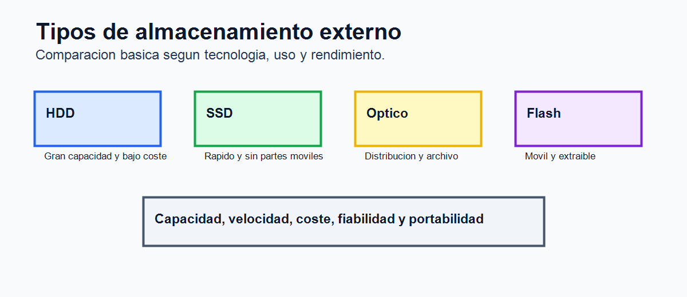
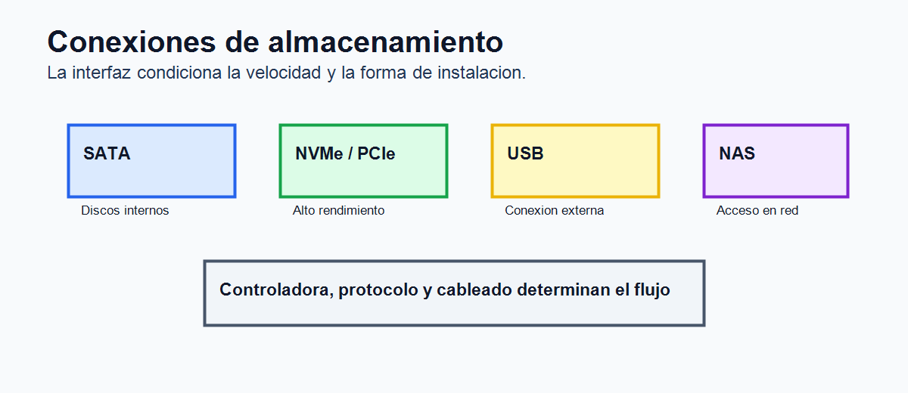

# Tema 6. Almacenamiento externo

## Índice

1. Introducción. 2. Función del almacenamiento externo. 3. Tecnologías principales. 4. Conexiones y protocolos. 5. Clasificación de los soportes. 6. Sistemas de archivos y organización. 7. Almacenamiento en red y nube. 8. Características técnicas. 9. Seguridad, copias y mantenimiento. 10. Tendencias. 11. Contextualización. 12. Conclusión. 13. Esquema rápido.

## 1. Introducción

Los sistemas informáticos necesitan conservar información más allá de la ejecución inmediata de los programas. La memoria principal es rápida, pero volátil y limitada; por ello se emplean dispositivos de almacenamiento externo, capaces de guardar datos de forma persistente y con mayor capacidad. Gracias a ellos se conservan sistemas operativos, aplicaciones, documentos, bases de datos, copias de seguridad, imágenes, vídeo y grandes volúmenes de información.

El almacenamiento externo ha evolucionado desde soportes magnéticos y ópticos hasta unidades de estado sólido, almacenamiento en red y servicios en la nube. Esta evolución ha mejorado velocidad, capacidad y portabilidad, pero también ha introducido nuevos criterios de elección: interfaz, protocolo, fiabilidad, consumo, coste por gigabyte, seguridad y facilidad de recuperación.

En un ordenador actual, el almacenamiento condiciona mucho la experiencia de uso. Un procesador potente puede verse limitado si el sistema arranca desde un disco lento o si las aplicaciones esperan continuamente a operaciones de lectura y escritura. Por ello, su estudio es esencial en arquitectura de computadores, montaje de equipos y administración de sistemas.

## 2. Función del almacenamiento externo

La función principal del almacenamiento externo es conservar información de forma no volátil. Esto significa que los datos permanecen aunque el equipo se apague. Además, permite ampliar capacidad, transportar información, compartir datos entre sistemas y realizar copias de seguridad.

Frente a la RAM, el almacenamiento externo ofrece mayor capacidad y menor coste por unidad, aunque con más latencia y menor velocidad. La RAM se utiliza para datos en uso inmediato; el almacenamiento externo conserva datos a largo plazo. Ambos niveles forman parte de la jerarquía de memoria del sistema.

También cumple una función organizativa. Los datos se almacenan en particiones, volúmenes, directorios y archivos. El sistema operativo gestiona permisos, nombres, metadatos y acceso concurrente. En entornos profesionales, el almacenamiento debe garantizar disponibilidad, integridad y recuperación ante fallos.

## 3. Tecnologías principales

Existen varias tecnologías de almacenamiento externo, cada una con ventajas y limitaciones.

Los discos duros HDD utilizan platos magnéticos giratorios y cabezales de lectura/escritura. Ofrecen gran capacidad a bajo coste, por lo que siguen siendo útiles para archivo, copias de seguridad y almacenamiento masivo. Su punto débil es la latencia mecánica: el cabezal debe desplazarse y esperar a que el sector adecuado pase bajo él. También son sensibles a golpes y vibraciones.

Las unidades SSD usan memoria Flash NAND. No tienen partes móviles, son silenciosas, resistentes y mucho más rápidas en acceso aleatorio. Incorporan controladores, caché interna, algoritmos de wear leveling y corrección de errores. Su vida útil se mide mediante parámetros como TBW, que estima la cantidad total de datos que pueden escribirse.

Los soportes ópticos, como CD, DVD y Blu-ray, emplean láser para lectura y escritura. Han perdido protagonismo en equipos de consumo, pero pueden usarse para distribución, archivo o entornos donde interesa un soporte extraíble y económico. Las cintas magnéticas mantienen presencia en copias de seguridad empresariales por su bajo coste por terabyte y buena conservación.

Las memorias USB y tarjetas SD o microSD usan memoria Flash y destacan por portabilidad. Son habituales en cámaras, móviles, sistemas embebidos y transferencia rápida de archivos, aunque su fiabilidad varía mucho según calidad y uso.

## 4. Conexiones y protocolos

La conexión determina velocidad, compatibilidad, alimentación y escenario de uso.

USB es la interfaz externa más extendida. Ha evolucionado desde versiones lentas hasta USB 3, USB4 y USB-C, que permiten altas velocidades y alimentación eléctrica. SATA se ha usado tradicionalmente para discos internos y SSD de 2,5 pulgadas. PCI Express, junto con NVMe, permite aprovechar el rendimiento de los SSD modernos al reducir latencia y aumentar paralelismo.

Thunderbolt ofrece gran ancho de banda para almacenamiento externo profesional. SAS se emplea en servidores por fiabilidad y rendimiento. En red aparecen protocolos como SMB, NFS, iSCSI o Fibre Channel, que permiten acceder a almacenamiento compartido desde varios equipos.

Conviene distinguir entre interfaz física y protocolo. M.2, por ejemplo, es un formato de conexión, pero una unidad M.2 puede usar SATA o NVMe. Del mismo modo, USB-C describe el conector, no siempre la velocidad real.

## 5. Clasificación de los soportes

El almacenamiento externo puede clasificarse por tecnología, modo de acceso, ubicación, portabilidad y finalidad. Según la tecnología puede ser magnético, óptico, semiconductor o remoto. Según el modo de acceso puede ser directo, como HDD y SSD, o secuencial, como cintas magnéticas. El acceso directo permite localizar bloques concretos con rapidez; el secuencial resulta adecuado para copias masivas.

Según la ubicación, puede ser interno, externo, extraíble, de red o en la nube. Según la finalidad, puede destinarse a sistema operativo, datos de usuario, copias de seguridad, archivo histórico, alta disponibilidad o intercambio temporal.

También se diferencia entre soportes reutilizables y soportes de solo lectura o escritura limitada. Esta clasificación ayuda a elegir la tecnología adecuada según rendimiento, coste, seguridad y vida útil esperada.

## 6. Sistemas de archivos y organización

Para que el sistema operativo use un dispositivo de almacenamiento, normalmente se crea una tabla de particiones, se formatean volúmenes y se aplica un sistema de archivos. Entre los sistemas de archivos habituales están NTFS, FAT32, exFAT, ext4, APFS y otros específicos de servidores o almacenamiento avanzado.

FAT32 ofrece compatibilidad amplia, pero limita el tamaño máximo de archivo. exFAT resulta útil en memorias externas modernas. NTFS incorpora permisos, journaling y características avanzadas en Windows. ext4 es común en Linux. En entornos profesionales aparecen sistemas con instantáneas, compresión, verificación de integridad o gestión avanzada de volúmenes.

La organización lógica influye en seguridad y mantenimiento. Una estructura clara de carpetas, nombres adecuados, permisos correctos y políticas de copia reducen pérdidas y facilitan auditorías.

## 7. Almacenamiento en red y nube

En organizaciones es habitual usar almacenamiento compartido. DAS es almacenamiento conectado directamente a un equipo. NAS proporciona almacenamiento a través de red local y suele usar SMB o NFS. SAN ofrece almacenamiento a nivel de bloque, con alto rendimiento, frecuente en servidores y virtualización.

La nube permite acceder a datos desde cualquier lugar mediante Internet. Puede usarse para sincronización, copias remotas, colaboración o archivo. Sus ventajas son escalabilidad y disponibilidad; sus riesgos son dependencia de conectividad, costes recurrentes, privacidad, cumplimiento normativo y seguridad de credenciales.

Muchas organizaciones emplean modelos híbridos: almacenamiento local para rendimiento y nube para respaldo, colaboración o recuperación ante desastres.

## 8. Características técnicas

Las características principales son capacidad, latencia, tasa de transferencia, IOPS, fiabilidad, consumo, resistencia, ruido, tamaño físico y coste. En HDD importan revoluciones por minuto, caché, tiempo de búsqueda y tasa sostenida. En SSD destacan interfaz, protocolo, tipo de NAND, controlador, durabilidad y rendimiento sostenido cuando se agota la caché.

IOPS mide operaciones de entrada/salida por segundo y es especialmente relevante en bases de datos, virtualización y sistemas con muchos accesos pequeños. La tasa secuencial importa en copia de archivos grandes, vídeo o copias de seguridad.

La fiabilidad se valora mediante MTBF, tasa de errores, garantías y datos SMART. Ningún soporte es infalible, por lo que no debe confundirse fiabilidad con ausencia de copias.

Otro aspecto relevante es el comportamiento bajo carga sostenida. Algunas unidades SSD alcanzan velocidades muy altas durante pocos segundos gracias a una caché rápida, pero reducen su rendimiento cuando esta se llena o aumenta la temperatura. En servidores y estaciones de trabajo interesa revisar el rendimiento sostenido, la disipación y la resistencia a escrituras continuas.

## 9. Seguridad, copias y mantenimiento

La seguridad del almacenamiento incluye confidencialidad, integridad y disponibilidad. El cifrado protege datos si se pierde un dispositivo. Los permisos evitan accesos indebidos. La monitorización detecta fallos tempranos. Las copias de seguridad permiten recuperar información ante borrado, avería, malware o desastre.

Una regla práctica es mantener varias copias, en soportes distintos y al menos una fuera del equipo principal. En empresas se usan políticas de retención, copias incrementales, diferenciales, completas e inmutables frente a ransomware.

El mantenimiento incluye revisar estado SMART, actualizar firmware cuando proceda, evitar temperaturas excesivas, comprobar sistemas de archivos, sustituir soportes degradados y probar restauraciones. Una copia que nunca se prueba puede no servir cuando realmente se necesite.

También es importante planificar el final de vida de los soportes. Antes de retirar, reutilizar o vender un dispositivo deben borrarse los datos de forma segura. En discos magnéticos puede usarse sobrescritura; en SSD conviene utilizar funciones de borrado seguro del fabricante o cifrado previo, ya que la gestión interna de bloques dificulta garantizar una eliminación manual completa.

## 10. Tendencias

Las tendencias actuales apuntan a SSD NVMe, PCIe de mayor velocidad, USB4, Thunderbolt, almacenamiento definido por software, almacenamiento en nube, copias inmutables, deduplicación, compresión y soluciones híbridas. También crece la importancia de la eficiencia energética en centros de datos.

El aumento de datos generados por inteligencia artificial, vídeo, sensores e Internet de las cosas exige soluciones escalables. Al mismo tiempo, la seguridad gana relevancia por el impacto del ransomware y la necesidad de continuidad de negocio.

## 11. Contextualización

Este tema conecta con montaje de equipos, sistemas operativos, redes, bases de datos, seguridad y administración de sistemas. En Formación Profesional permite trabajar particionado, instalación de sistemas, clonación, copias de seguridad, NAS, permisos, recuperación de datos y análisis de rendimiento.

También tiene aplicación directa en la vida profesional: elegir un SSD para mejorar un equipo, diseñar un sistema de copias, montar un NAS de aula o valorar almacenamiento para servidores.

## 12. Conclusión

El almacenamiento externo complementa a la memoria interna proporcionando persistencia, capacidad, portabilidad y seguridad. HDD, SSD, soportes ópticos, memorias Flash, NAS, SAN y nube responden a necesidades diferentes.

Elegir correctamente exige valorar rendimiento, capacidad, coste, fiabilidad, seguridad y escenario de uso. La tecnología más rápida no siempre es la más adecuada: para archivo masivo puede convenir HDD; para sistema operativo, SSD; para colaboración, NAS o nube; y para continuidad de negocio, copias bien planificadas.

## 13. Esquema rápido

1. Función: conservar datos de forma persistente. 2. Tecnologías: HDD, SSD, óptico, Flash, cinta y nube. 3. Conexiones: USB, SATA, PCIe/NVMe, Thunderbolt, SAS y red. 4. Organización: particiones, volúmenes y sistemas de archivos. 5. Seguridad: copias, RAID, cifrado, SMART y restauración. 6. Tendencias: NVMe, nube, almacenamiento híbrido y copias inmutables.
