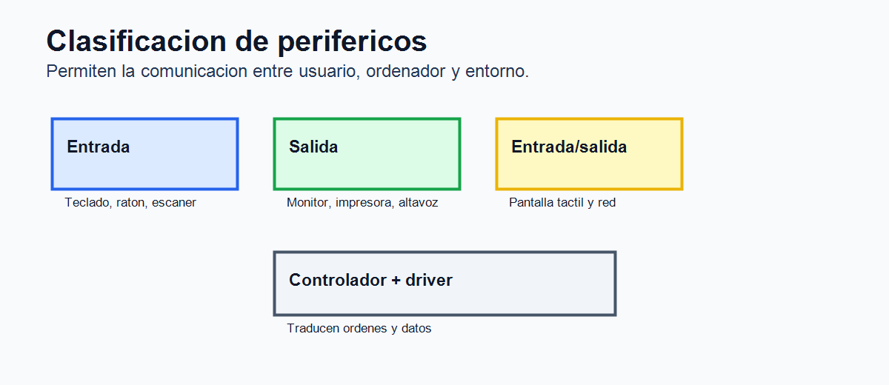
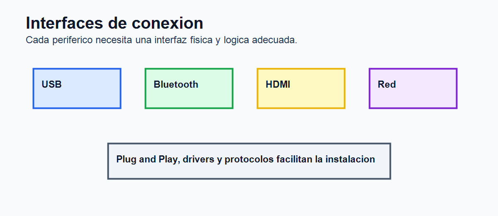

# Tema 7. Dispositivos periféricos de entrada/salida: características y funcionamiento

## Índice

1. Introducción. 2. Concepto y clasificación de periféricos. 3. Interfaces de conexión. 4. Periféricos de entrada. 5. Periféricos de salida. 6. Periféricos de entrada/salida. 7. Características técnicas. 8. Funcionamiento interno y controladores. 9. Instalación, mantenimiento y seguridad. 10. Tendencias. 11. Contextualización. 12. Conclusión. 13. Esquema rápido.

## 1. Introducción

Los periféricos permiten la comunicación entre el ordenador y el exterior. Gracias a ellos el usuario introduce datos, recibe resultados, almacena información, imprime documentos, captura imágenes, reproduce sonido o se conecta a redes. Aunque CPU y memoria realizan el procesamiento principal, un equipo informático sería poco útil sin dispositivos de entrada y salida.

Teclados, ratones, pantallas, impresoras, cámaras, micrófonos, escáneres, altavoces, lectores biométricos, tarjetas de red y dispositivos táctiles forman parte de la experiencia cotidiana con los sistemas informáticos. Su estudio resulta necesario porque influyen en productividad, accesibilidad, seguridad, ergonomía y mantenimiento.

Además, los periféricos han evolucionado mucho. Muchos ya no son dispositivos simples, sino equipos con procesadores propios, firmware, memoria interna, conectividad inalámbrica y funciones inteligentes. Por ello, conocer sus características y funcionamiento ayuda a seleccionarlos, instalarlos y resolver incidencias.

## 2. Concepto y clasificación de periféricos

Un periférico es un dispositivo conectado al ordenador que amplía sus capacidades de entrada, salida, almacenamiento o comunicación. Puede ser externo o interno, cableado o inalámbrico, especializado o multifunción.

La clasificación más habitual distingue periféricos de entrada, de salida y de entrada/salida. Los de entrada capturan información del usuario o del entorno, como teclado, ratón, escáner o micrófono. Los de salida presentan información procesada, como monitor, impresora o altavoces. Los de entrada/salida permiten comunicación en ambos sentidos, como pantalla táctil, tarjeta de red, impresora multifunción o unidad de almacenamiento externa.

También pueden clasificarse por finalidad: periféricos de comunicación, de almacenamiento, multimedia, biométricos, industriales o de accesibilidad. Esta clasificación no siempre es rígida, ya que muchos dispositivos actuales integran varias funciones.

## 3. Interfaces de conexión

La conexión entre periférico y ordenador se realiza mediante una interfaz física y un protocolo de comunicación. Entre las interfaces externas destacan USB, HDMI, DisplayPort, RJ-45, audio, Bluetooth, Wi-Fi y Thunderbolt. Entre las internas aparecen PCI Express, SATA, M.2, conectores de ventiladores, cabeceras USB y ranuras de expansión.

USB es la interfaz general más extendida para teclado, ratón, impresoras, almacenamiento externo, cámaras y otros dispositivos. HDMI y DisplayPort transmiten vídeo y audio digital. RJ-45 conecta redes Ethernet. Bluetooth y Wi-Fi permiten comunicación inalámbrica. Thunderbolt ofrece gran velocidad para monitores, almacenamiento y estaciones de conexión.

Es importante distinguir conector, protocolo y velocidad real. Un mismo conector USB-C puede soportar velocidades distintas según versión y dispositivo. En mantenimiento informático, esta distinción evita errores al diagnosticar problemas de rendimiento o compatibilidad.

## 4. Periféricos de entrada

Los periféricos de entrada capturan información del usuario o del entorno y la transforman en datos que el sistema puede procesar. El teclado funciona mediante una matriz de filas y columnas. Al pulsar una tecla se detecta una posición y se envía un código al sistema. Los teclados pueden ser de membrana, mecánicos, inalámbricos, ergonómicos o específicos para ciertos usos.

El ratón transforma movimiento y pulsaciones en señales digitales. Puede ser óptico, láser, cableado o inalámbrico. Sus características incluyen resolución en DPI, frecuencia de sondeo, número de botones, ergonomía y latencia. En portátiles también se usa touchpad, que detecta gestos mediante sensores capacitivos.

El escáner convierte documentos físicos en imágenes digitales. Puede ser plano, de alimentación automática, portátil o integrado en impresoras multifunción. La webcam captura vídeo e imagen; el micrófono convierte sonido en señal digital mediante conversores. Los lectores de códigos de barras y QR se emplean en comercio, almacenes y logística.

Los dispositivos biométricos, como lectores de huella o reconocimiento facial, permiten autenticación. Deben tratarse con especial cuidado porque manejan datos personales sensibles. También existen tabletas digitalizadoras, joysticks, sensores ambientales, lectores de tarjetas y dispositivos adaptados para accesibilidad.

## 5. Periféricos de salida

Los periféricos de salida presentan información procesada por el ordenador. El monitor es el más habitual. Sus características principales son tamaño, resolución, frecuencia de refresco, tiempo de respuesta, brillo, contraste, tipo de panel y fidelidad de color. Tecnologías como LCD, LED, OLED o miniLED ofrecen distintas ventajas.

La resolución indica el número de píxeles; la frecuencia de refresco mide cuántas veces se actualiza la imagen por segundo; el tiempo de respuesta influye en la nitidez de movimientos. En diseño gráfico importa la reproducción del color; en juegos, la frecuencia y latencia; en oficina, ergonomía y comodidad visual.

Las impresoras trasladan información digital a soporte físico. Pueden ser de inyección de tinta, láser, térmicas, matriciales o 3D. Las láser son habituales en oficina por velocidad y coste por página. Las de tinta ofrecen buena calidad fotográfica. Las térmicas se usan en tickets y etiquetas. Las 3D fabrican objetos mediante deposición o curado de material.

Altavoces y auriculares convierten señales digitales o analógicas en sonido. También son periféricos de salida proyectores, plotters, sistemas hápticos, paneles informativos y dispositivos de señalización industrial.

## 6. Periféricos de entrada/salida

Los periféricos de entrada/salida realizan comunicación en ambos sentidos. Una pantalla táctil muestra información y recibe pulsaciones. Una impresora multifunción imprime, escanea y copia. Una tarjeta de red envía y recibe datos. Las unidades de almacenamiento externas leen y escriben información.

Los módems y adaptadores de red permiten comunicación con otros sistemas. Las interfaces de audio profesionales capturan y reproducen sonido. Los dispositivos de realidad virtual combinan pantallas, sensores de movimiento, cámaras y controladores. En entornos industriales, controladores y sensores pueden intercambiar datos con máquinas y sistemas de supervisión.

Esta categoría es cada vez más importante porque muchos dispositivos son inteligentes y bidireccionales. Un periférico moderno puede recibir órdenes, enviar estado, actualizar firmware y almacenar configuraciones.

## 7. Características técnicas

Las características dependen del tipo de periférico, pero pueden agruparse en rendimiento, calidad, compatibilidad, ergonomía, consumo, fiabilidad y coste. En dispositivos de entrada importan precisión, sensibilidad, resolución, latencia, resistencia y comodidad. En pantallas destacan resolución, tamaño, frecuencia, brillo, contraste y color. En impresoras se valoran velocidad, resolución, coste por página, consumibles y mantenimiento.

En dispositivos inalámbricos importan autonomía, alcance, estabilidad y seguridad de la conexión. En periféricos profesionales se consideran certificaciones, soporte del fabricante, disponibilidad de repuestos y compatibilidad con sistemas operativos.

También es relevante el coste total de propiedad. Una impresora barata puede resultar cara si sus consumibles son costosos. Un monitor de mayor calidad puede reducir fatiga visual. Un teclado ergonómico puede mejorar comodidad en trabajos prolongados.

La accesibilidad debe considerarse una característica técnica y funcional. Existen teclados de alto contraste, ratones adaptados, pulsadores, lectores de pantalla, líneas braille, sistemas de reconocimiento de voz y dispositivos de seguimiento ocular. Estos periféricos permiten que usuarios con distintas necesidades puedan interactuar con el sistema de forma autónoma.

## 8. Funcionamiento interno y controladores

El sistema operativo se comunica con los periféricos mediante controladores o drivers. Estos traducen las órdenes generales del sistema a instrucciones específicas del dispositivo. Algunos periféricos usan controladores genéricos; otros requieren software del fabricante para activar funciones avanzadas.

La entrada/salida puede gestionarse por sondeo, interrupciones o acceso directo a memoria. En el sondeo, la CPU consulta repetidamente el estado del dispositivo. Con interrupciones, el dispositivo avisa cuando necesita atención, evitando comprobaciones constantes. El DMA permite transferir datos entre dispositivo y memoria sin intervención continua del procesador, mejorando eficiencia.

Muchos periféricos incluyen firmware, es decir, software interno que controla su funcionamiento. Actualizar firmware puede corregir errores o mejorar compatibilidad, aunque debe hacerse con precaución para evitar dejar el dispositivo inutilizable.

## 9. Instalación, mantenimiento y seguridad

La instalación de periféricos implica conexión física, reconocimiento por el sistema, instalación de controladores y configuración. En sistemas modernos, Plug and Play simplifica el proceso, pero pueden aparecer conflictos de drivers, falta de alimentación, cables inadecuados o versiones incompatibles.

El mantenimiento incluye limpieza, revisión de cables, actualización de controladores, sustitución de consumibles, calibración y comprobación de estado. En impresoras se revisan tóner, tinta, tambores, cabezales y atascos. En monitores se comprueban cables, resolución y frecuencia. En dispositivos inalámbricos se revisan baterías e interferencias.

La seguridad es cada vez más importante. Cámaras y micrófonos pueden comprometer privacidad. Impresoras de red almacenan documentos y deben protegerse con contraseñas, actualizaciones y segmentación. Dispositivos USB desconocidos pueden contener malware. Los periféricos biométricos exigen especial protección de datos.

En centros educativos y oficinas conviene aplicar políticas sencillas: inventariar dispositivos, evitar periféricos desconocidos, mantener controladores actualizados, limitar permisos de impresión, proteger la configuración de red y revisar qué equipos tienen cámara, micrófono o almacenamiento interno.

## 10. Tendencias

Las tendencias actuales apuntan a conectividad USB-C, periféricos inalámbricos de baja latencia, biometría, sensores avanzados, pantallas de alta frecuencia, impresión 3D, realidad virtual y aumentada, dispositivos inteligentes e integración con inteligencia artificial.

También crece la atención a accesibilidad, ergonomía y sostenibilidad. Hay teclados adaptados, lectores de pantalla, dispositivos de seguimiento ocular, ratones verticales y periféricos diseñados para reducir esfuerzo físico. En sostenibilidad se valora consumo, reparabilidad, vida útil y reciclaje de consumibles.

## 11. Contextualización

Este tema se relaciona con montaje de equipos, sistemas operativos, redes, seguridad y atención al usuario. En Formación Profesional permite trabajar instalación de drivers, configuración de impresoras, resolución de incidencias, mantenimiento preventivo, ergonomía y selección de dispositivos.

En un entorno educativo o profesional, saber diagnosticar un periférico evita interrupciones: una impresora mal configurada, un monitor sin señal o un teclado defectuoso pueden afectar directamente al trabajo diario.

Por ello, la gestión de periféricos forma parte del soporte técnico básico y de la calidad del servicio informático.

## 12. Conclusión

Los periféricos son imprescindibles para que el ordenador interactúe con usuarios, otros equipos y el entorno físico. Su correcta elección y configuración influye en rendimiento, comodidad, seguridad y productividad.

Conocer sus tipos, interfaces, características, controladores y mantenimiento permite seleccionar dispositivos adecuados, diagnosticar problemas y garantizar sistemas informáticos funcionales. La evolución hacia dispositivos inteligentes e inalámbricos refuerza la necesidad de comprender tanto su parte física como su gestión lógica.

## 13. Esquema rápido

1. Entrada: teclado, ratón, escáner, micrófono, cámara y sensores. 2. Salida: monitor, impresora, altavoces, proyector y plotter. 3. Entrada/salida: pantalla táctil, red, almacenamiento y multifunción. 4. Interfaces: USB, HDMI, DisplayPort, RJ-45, Bluetooth, Wi-Fi y PCIe. 5. Gestión: drivers, firmware, interrupciones y DMA. 6. Seguridad: privacidad, USB, red, biometría y actualizaciones.
