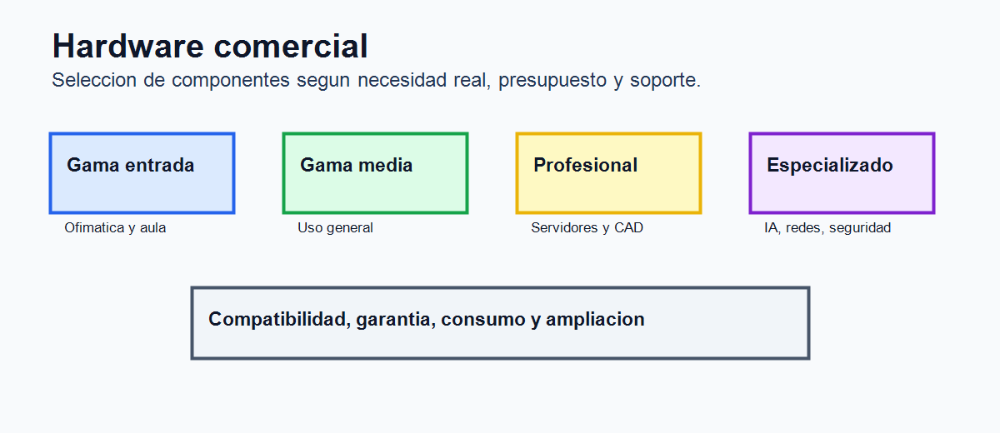
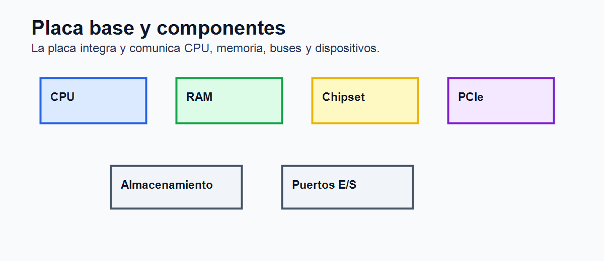

# Tema 8. Hardware comercial de un ordenador

## Índice

1. Introducción. 2. Concepto de hardware comercial. 3. Placa base. 4. Procesador, memoria y almacenamiento. 5. Tarjetas de expansión y controladoras. 6. Fuente de alimentación, refrigeración y caja. 7. Periféricos internos y conectividad. 8. Compatibilidad y criterios de selección. 9. Diagnóstico y mantenimiento. 10. Tendencias. 11. Contextualización. 12. Conclusión. 13. Esquema rápido.

## 1. Introducción

El hardware comercial de un ordenador está formado por los componentes físicos disponibles en el mercado para construir, ampliar, reparar o mantener un equipo informático. Incluye placa base, procesador, memoria, almacenamiento, fuente de alimentación, caja, refrigeración, tarjetas de expansión, controladoras y periféricos internos. A diferencia del estudio puramente teórico de la arquitectura de computadores, aquí interesa conocer componentes reales, formatos, conectores, compatibilidades, precios y criterios de elección.

Comprender el hardware comercial es esencial para un técnico informático. Permite interpretar especificaciones, comparar equipos, elaborar presupuestos, diagnosticar averías, sustituir piezas y planificar ampliaciones. También evita errores frecuentes, como instalar memoria incompatible, elegir una fuente insuficiente, montar una tarjeta gráfica que no cabe en la caja o adquirir un procesador no soportado por la placa.

La elección de hardware debe responder al uso previsto: ofimática, docencia, juegos, edición multimedia, diseño, desarrollo, virtualización, servidores, redes o sistemas especializados. No existe un componente mejor en términos absolutos, sino configuraciones adecuadas a necesidades, presupuesto, fiabilidad y posibilidades de mantenimiento.

## 2. Concepto de hardware comercial

El hardware comercial se refiere al conjunto de componentes que se venden para equipos informáticos reales. Está condicionado por fabricantes, estándares, formatos físicos, conectores, disponibilidad, garantías y ciclos de mercado. Por ello, el técnico debe combinar conocimientos de arquitectura con información práctica.

Un ordenador comercial puede ser de sobremesa, portátil, estación de trabajo, servidor, mini PC, equipo industrial o sistema embebido. En equipos de sobremesa suele haber mayor capacidad de ampliación. En portátiles prima la integración y el bajo consumo. En servidores se priorizan fiabilidad, redundancia, capacidad de memoria, almacenamiento seguro y gestión remota.

La documentación técnica es clave: manual de placa base, lista de procesadores compatibles, especificaciones de memoria, potencia recomendada, dimensiones y conectores. La compatibilidad no debe suponerse; debe comprobarse.

## 3. Placa base

La placa base es el elemento que integra y comunica los componentes principales del ordenador. Determina qué procesadores, memoria, almacenamiento, tarjetas y periféricos internos pueden instalarse.

El factor de forma define dimensiones, distribución y compatibilidad con la caja. Los formatos más comunes son ATX, microATX y mini-ITX. ATX ofrece mayor capacidad de expansión; microATX reduce tamaño manteniendo buena compatibilidad; mini-ITX se usa en equipos compactos.

La placa incluye socket de CPU, ranuras DIMM para memoria, chipset, conectores de alimentación, ranuras PCI Express, puertos SATA, conectores M.2, puertos traseros, cabeceras internas y firmware BIOS/UEFI. El socket debe coincidir con el procesador. El chipset determina funciones disponibles, número de líneas, overclocking, puertos y soporte de tecnologías.

La BIOS/UEFI inicializa el hardware, permite configurar arranque, seguridad, perfiles de memoria, virtualización y actualizaciones. En equipos modernos, UEFI sustituye a la BIOS clásica y ofrece una gestión más avanzada.

## 4. Procesador, memoria y almacenamiento

El procesador determina gran parte del rendimiento. Debe ser compatible con socket, chipset y versión de BIOS/UEFI. Además, debe ir acompañado de refrigeración adecuada y una fuente capaz de alimentar el conjunto. En la elección se valoran núcleos, hilos, frecuencia, caché, consumo, gráficos integrados, instrucciones soportadas y relación precio/rendimiento.

La memoria RAM debe ajustarse al tipo admitido por la placa, como DDR4 o DDR5, capacidad máxima, velocidad y número de módulos. Una configuración en doble canal mejora el ancho de banda. En servidores puede usarse memoria ECC, capaz de detectar y corregir errores, aumentando fiabilidad.

El almacenamiento puede ser HDD, SSD SATA o SSD NVMe. Los SSD NVMe ofrecen gran rendimiento al usar PCI Express, por lo que son adecuados para sistema operativo y aplicaciones. Los HDD siguen siendo útiles para grandes capacidades a bajo coste. En equipos profesionales puede combinarse SSD rápido para trabajo activo y HDD o NAS para archivo.

La tarjeta gráfica puede estar integrada en el procesador o ser dedicada. Las GPU dedicadas son relevantes en juegos, diseño 3D, edición de vídeo, cálculo paralelo e inteligencia artificial. Para elegirla se valoran rendimiento, memoria de vídeo, consumo, tamaño físico, conectores de alimentación y salidas de vídeo.

## 5. Tarjetas de expansión y controladoras

Las tarjetas de expansión amplían capacidades mediante ranuras PCI Express. Pueden ser gráficas, de sonido, de red, Wi-Fi, capturadoras de vídeo, controladoras SATA, USB, RAID, adaptadores profesionales o tarjetas específicas para entornos industriales.

Las controladoras gestionan la comunicación entre el sistema y determinados dispositivos. Aunque muchas funciones están integradas en la placa base, las tarjetas dedicadas siguen siendo útiles cuando se requiere más rendimiento, más puertos, conectividad concreta o redundancia.

En servidores y estaciones de trabajo son habituales controladoras RAID, tarjetas de red de alta velocidad, adaptadores Fibre Channel o tarjetas aceleradoras. En equipos domésticos, lo más común es ampliar red, sonido, almacenamiento o vídeo.

## 6. Fuente de alimentación, refrigeración y caja

La fuente de alimentación convierte la corriente alterna en tensiones estables para los componentes. Debe ofrecer potencia suficiente, conectores adecuados y protecciones eléctricas. La certificación de eficiencia indica cuánto aprovecha la energía consumida, aunque no garantiza por sí sola calidad. Una fuente deficiente puede provocar apagados, inestabilidad o daños.

Para dimensionarla se considera consumo de CPU, GPU, discos, ventiladores y margen futuro. También importan conectores PCIe, EPS para CPU, SATA y longitud de cables. En equipos profesionales se valora la fiabilidad por encima de ahorrar en un componente crítico.

La refrigeración mantiene temperaturas seguras. Puede ser por aire, líquida o híbrida. Una mala refrigeración produce ruido, reducción automática de frecuencia, apagados y menor vida útil. La caja condiciona flujo de aire, tamaño de componentes, organización de cables, filtros de polvo, bahías y facilidad de mantenimiento.

No debe elegirse la caja solo por estética. Hay que comprobar longitud máxima de GPU, altura del disipador, formato de placa, espacio para radiadores, número de ventiladores y accesibilidad.

## 7. Periféricos internos y conectividad

Además de los componentes principales, un equipo puede incluir unidades ópticas, lectores de tarjetas, tarjetas de captura, interfaces de audio, módulos Wi-Fi/Bluetooth, ventiladores, sensores y controladoras. Muchos de estos elementos se conectan a cabeceras internas USB, audio frontal, RGB, ventiladores o panel frontal.

La conectividad externa también forma parte del hardware comercial. Puertos USB, USB-C, HDMI, DisplayPort, Ethernet, audio, Wi-Fi y Bluetooth determinan qué dispositivos pueden conectarse sin adaptadores. En equipos profesionales, la disponibilidad de puertos adecuados puede ser tan importante como la potencia.

La gestión de cables y la documentación de conexiones internas facilitan mantenimiento. Un montaje ordenado mejora flujo de aire y reduce errores al intervenir posteriormente.

## 8. Compatibilidad y criterios de selección

La selección de hardware exige comprobar compatibilidad entre placa, CPU, RAM, caja, fuente, almacenamiento, GPU y sistema operativo. También se valoran consumo, espacio físico, conectores, ampliación futura, presupuesto y garantía.

En equipos de oficina se busca estabilidad, bajo consumo y coste razonable. En equipos docentes se valora mantenimiento sencillo y homogeneidad. En juegos importa GPU, CPU, refrigeración y fuente. En edición multimedia se priorizan CPU, RAM, GPU y almacenamiento rápido. En servidores se requieren redundancia, memoria ECC, almacenamiento seguro, red fiable y gestión remota.

El equilibrio es fundamental. No tiene sentido montar una GPU de alto consumo con fuente insuficiente, ni un procesador de gama alta con poca RAM y almacenamiento lento. Tampoco conviene sobredimensionar equipos cuando el uso será básico.

Una metodología práctica consiste en partir de los requisitos del usuario, fijar presupuesto, elegir plataforma base y comprobar compatibilidades antes de comprar. Después se reserva margen para ampliaciones y se documenta la configuración. Así se evitan decisiones impulsivas basadas solo en publicidad o en una característica aislada.

## 9. Diagnóstico y mantenimiento

El diagnóstico de hardware comienza observando síntomas: el equipo no enciende, no muestra imagen, se reinicia, hace ruido, se calienta, no detecta discos o muestra errores. Después se revisan conexiones, fuente, memoria, temperaturas, estado SMART, ventiladores, firmware y registros del sistema.

Herramientas de diagnóstico permiten comprobar RAM, disco, temperatura, voltajes y rendimiento. El mantenimiento preventivo incluye limpieza de polvo, sustitución de pasta térmica cuando proceda, actualización de BIOS/UEFI si es necesario, revisión de cables y control de temperaturas.

También es importante documentar cambios. Registrar componentes, números de serie, fechas de compra y garantías facilita soporte técnico y renovación de equipos.

## 10. Tendencias

Las tendencias actuales incluyen PCIe de alta velocidad, SSD NVMe, USB-C, Wi-Fi integrado, placas con mejores fases de alimentación, UEFI más completas, eficiencia energética, equipos compactos y hardware optimizado para inteligencia artificial.

También crece la integración. Muchos equipos reducen posibilidades de ampliación, especialmente portátiles y mini PC. A la vez, aumenta la importancia de sostenibilidad, reparabilidad, bajo consumo y reutilización de componentes. En empresas se valora el ciclo de vida completo: compra, mantenimiento, consumo, garantía, reparación y retirada segura.

La inteligencia artificial y el procesamiento gráfico han aumentado la importancia de GPU y aceleradores. En servidores, la densidad de cómputo y eficiencia energética son factores decisivos.

## 11. Contextualización

Este tema se relaciona directamente con montaje y mantenimiento de equipos, sistemas informáticos, redes, seguridad y soporte técnico. En Formación Profesional permite trabajar presupuestos, compatibilidad, montaje, ampliación, diagnóstico, documentación técnica y resolución de incidencias.

También tiene aplicación práctica inmediata: elegir un equipo para un aula, ampliar RAM, cambiar almacenamiento, diagnosticar una fuente defectuosa o valorar si conviene reparar o sustituir un ordenador.

## 12. Conclusión

El hardware comercial concreta la arquitectura del ordenador en componentes reales. La placa base actúa como elemento integrador y condiciona procesador, memoria, almacenamiento, expansión y conectividad.

Conocer componentes, conectores, factores de forma, fuentes, refrigeración y criterios de compatibilidad permite seleccionar equipos adecuados y resolver incidencias con criterio profesional. La mejor configuración no es la más cara, sino la que responde al uso previsto con equilibrio, fiabilidad y posibilidad de mantenimiento.

## 13. Esquema rápido

1. Hardware comercial: componentes físicos disponibles en el mercado. 2. Placa base: socket, chipset, DIMM, PCIe, SATA, M.2 y UEFI. 3. Componentes: CPU, RAM, SSD/HDD, GPU, fuente, caja y refrigeración. 4. Selección: compatibilidad, consumo, rendimiento, coste y garantía. 5. Mantenimiento: diagnóstico, limpieza, temperaturas, SMART y documentación. 6. Tendencias: NVMe, USB-C, integración, eficiencia e inteligencia artificial.
